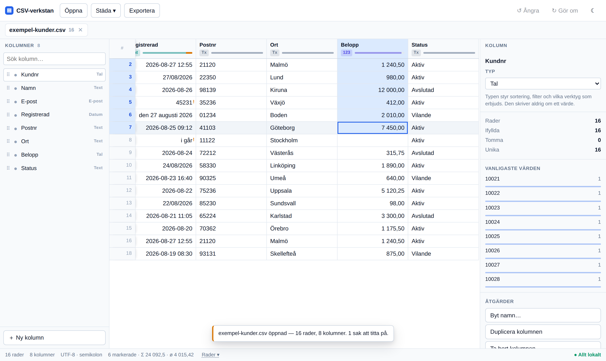

# CSV-verkstan

Ett webbaserat verktyg för att läsa in, städa, matcha och exportera CSV- och Excel-data. Det körs **helt i webbläsaren** — ingen fil laddas upp någonstans.



📖 **[Användarguide](docs/ANVANDARGUIDE.md)** — hur varje verktyg används, med bilder och ett klick till rätt avsnitt. ([User guide in English](docs/USER-GUIDE.md))

Guiden svarar på *hur gör jag*. Resten av den här filen svarar på *varför är det byggt så*.

## Två principer

**Originaltexten är sanningen.** Kolumntypen (`Text` / `Tal` / `Datum` / `E-post`) är en *tolkning* som styr sortering, filter och vilka verktyg som erbjuds. Den skriver aldrig om ett värde. Postnumret `01234` förblir `01234`, telefonnumret `0730-123456` förblir som det är, och `007` blir aldrig `7`.

**Inget ändras utan att du ser resultatet först.** Varje åtgärd visar siffror och exempel innan den körs, och allt går att ångra.

## Integriteten går att kontrollera

Sidan levereras med en säkerhetspolicy som innehåller `connect-src 'none'`. Webbläsaren tillåter alltså inte appen att göra ett enda nätverksanrop — det är inte ett löfte i en text, utan något du kan verifiera själv i utvecklarverktygens nätverksflik. Ett test i CI misslyckas om appen någonsin försöker.

Inga externa typsnitt, inget CDN, ingen analys, ingen felrapportering, ingen inloggning.

## Vad som fungerar idag

- **Öppna** CSV, TXT, TSV och Excel (`.xlsx`) genom att släppa filen var som helst i fönstret, eller välja den. Flera filer samtidigt, som flikar. Arbetsböcker med flera blad låter dig välja blad.
- **Teckenkodning och avgränsare upptäcks** — UTF-8, UTF-8 med BOM, UTF-16 och Windows-1252, samt `;` `,` tabb och `|`. Importdialogen visar gissningen i stället för att fatta den i tysthet, och säger på svenska om svenska tecken ser rätt ut.
- **Importvarningar** för det som annars försvinner tyst: trasiga rader, dubbletta rubriker, tomma rubriker, Excels `sep=;`-rad och spökrader som bara är avgränsare. Öppnar du en fil vars innehåll är identiskt med en redan öppen flik sägs det rakt ut — men som en varning, inte som en fråga, eftersom man ibland vill ha två kopior att jämföra.
- **Kolumner** kan infogas, tas bort, byta namn, dupliceras, döljas och flyttas — genom att dra rubriken, dra i sidopanelen, eller via kolumnmenyn.
- **Kolumninspektör** med antal ifyllda, tomma, unika och otolkbara värden, plus de vanligaste värdena. Klick på ”Visa de N raderna” filtrerar fram problemen.
- **Kolumnöversikt** som svarar på frågan man ställer innan man börjar: *vad är det här för fil?* En rad per kolumn med typ, ifyllnad, unika värden, problem — och vad innehållet talar för att du gör härnäst. Klick på ett förslag öppnar rätt verktyg på rätt kolumn.
- **Högerklick** på en cell, en rubrik eller ett radnummer. Cellmenyn är kortare än kolumnmenyn med flit: kolumnens sällanåtgärder hör hemma på rubriken. Menyn kan styras med piltangenterna, och menytangenten öppnar den vid markeringen. En flercellsmarkering överlever högerklicket.
- **Verktygen föreslås utifrån innehållet, inte utifrån typen.** Kolumntypen kan inte uttrycka att en kolumn innehåller telefonnummer, och en kolumn med adresser kan mycket väl stå som text för att importen inte vågade gissa. Menyn frågar i stället verktygens egna inventeringsfunktioner och sätter det som passar överst, med sitt skäl utskrivet: *E-post → namn — 14 av 16 ser ut som adresser*. Resten göms inte, de ligger under *Fler verktyg*.
- **Redigera** celler direkt (`Enter`, `F2` eller dubbelklick), markera områden med mus eller `Skift`+piltangenter, töm markeringen med `Delete`, och fyll nedåt med `Ctrl+D`.
- **Snabbsumma** i statusraden för markeringen — antal, summa och medel, med svenska tal som `1 240,50` korrekt tolkade.
- **Rader** kan infogas, dubbleras och tas bort. Helt tomma rader och kolumner kan städas bort i ett svep.
- **Löpnummer** — *Lägg till kolumn med löpnummer* skriver 1, 2, 3 … i en ny kolumn först i filen, i radernas nuvarande ordning. Till skillnad från radnumret i kanten är det riktig data: det följer med vid export och går att sortera på, så en lista som sorterats om går att få tillbaka i sin ursprungliga ordning. Kolumnen är typad som tal och låst som sådan, så sorteringen går den numeriska vägen.
- **Urklipp mot Excel**: `Ctrl+C` kopierar markeringen som TSV, `Ctrl+V` klistrar in TSV eller CSV. Är det inklistrade större än markeringen frågar verktyget om det ska lägga till plats, klippa av, eller öppna det som en egen fil — det klipper aldrig av i tysthet.
  **Ett helt nytt underlag blir en egen flik.** I tomma läget öppnar en inklistring alltid datat som en ny fil. Med en fil öppen hamnar den i tabellen, vilket är rätt för celler ur Excel och fel för den som just kopierat något helt annat — så när det inklistrade ser ut som en hel tabell (flera rader och flera kolumner) erbjuder notisen *Öppna som ny fil i stället*, ett klick bort. `Ctrl+Skift+V` gör det direkt, och samma sak finns i cellmenyn och i paletten.
- **Sök** med `Ctrl+F`, accentokänsligt: `oberg` hittar `Öberg`. Träffarna markeras och räknas.
- **Städa text**: trimma blanksteg, slå ihop dubbla mellanslag, ta bort osynliga tecken, VERSALER, gemener och Stor Första Bokstav.
- **Verktyg över flera kolumner.** Datum, tal, telefon och sök & ersätt kör över hela markeringen: markera tolv månadskolumner, högerklicka och kör en gång. Inventeringen räknar cellerna i alla de valda kolumnerna, förhandsvisningen ritas i var och en, och `Ctrl+Z` backar hela körningen som ett steg. Verktygen som *skapar* kolumner arbetar på den kolumn du klickade i — tolv nya kolumner ur en markering är sällan vad någon menade.
- **Städverktyg med förhandsvisning i tabellen.** Panelen ligger bredvid tabellen, inte över den, och visar förslaget på ditt eget data medan du ställer in. En omskrivning ritas som <code>före → efter</code> i cellen; en ny kolumn ritas som en spökkolumn med streckad ram intill sin källa. `Bara ändrade` och `Bara problem` filtrerar fram just de raderna. Ingenting ändras förrän du klickar Tillämpa, och `Ctrl+Z` tar tillbaka det.
  - **Datum** — inventerar vilka format kolumnen faktiskt innehåller, med antal och exempel ur din fil. Tvetydiga format gissas aldrig: `03/04/2026` kan vara 3 april eller 4 mars, och verktyget letar först efter bevis i kolumnen (ett värde där ena talet är större än 12) innan det frågar. Ett datum passerar aldrig ett `Date`-objekt, så inga tidszoner kan förskjuta dygnet. Exceldatum som serienummer tolkas bara om du ber om det. Resultatet kan läggas i en **ny kolumn** i stället för att skriva över: har du `2026-08-27 12:55` och vill ha `2026-08-27` finns då båda kvar. Namnförslaget följer målformatet tills du skriver ett eget, och panelen säger vad de rader som inte går att tolka får i den nya kolumnen.
  - **Tal** — skalar av `kr`, `%` och tusentalsavgränsare, läser bokföringens `(1 240,50)` och `1240–` som negativa tal, och skriver om till decimalkomma eller decimalpunkt. Punktens tvetydighet (`1.234`) hanteras som datumens: bevis först, fråga sedan.
  - **Telefon** — normaliserar till `+46701234567` eller `0701234567` så att nummer går att jämföra. Ingen snygg gruppering, eftersom riktnumrets längd varierar och en gissning som blir fel ser rimlig ut.
  - **E-post → namn** — förnamn, efternamn, båda två som var sin kolumn i ett svep, `Förnamn Efternamn`, domän, domän utan toppdomän eller toppdomän, som nya kolumner bredvid adressen. Funktionsadresser som `info@` blir inte personer. Panelen säger rakt ut att å, ä och ö inte går att få tillbaka.
  - **Dela kolumn** — vid varje, första eller sista förekomsten av ett tecken, eller på en fast position. Det som inte får plats hamnar i sista kolumnen i stället för att försvinna.
  - **Slå ihop kolumner** — en mall som `{Förnamn} {Efternamn}`. Kolumnnamn som inte finns rapporteras i stället för att tyst bli tomma.
  - **Räkna** — en ny kolumn ur en formel: `{Antal} * {Pris}`, `RUNDA({Belopp} * 1,25; 2)`, `{Slut} - {Start}`. Fyra räknesätt, parenteser och fyra funktioner — inget villkorsspråk och inga celler som pekar på varandra, eftersom ett kalkylark betalar den kraften med att ingen längre vet vad en cell innehåller. Tal skrivs som i filen: `1 240,50` lika väl som `1240.5`. En datumkolumn räknas som antal dagar, så `{Slut} - {Start}` ger skillnaden i dagar; resultatet är alltid ett tal, aldrig ett gissat datum tillbaka. Tomma celler, text som inte är tal och division med noll ger tomt i stället för en nolla — en lucka går att se, en felaktig nolla gör det inte. Felet i formeln visas medan du skriver.
  - **Sök och ersätt** — bokstavligt eller reguljärt uttryck, med felet visat medan du skriver. Bokstavlig sökning är bokstavlig: `1.5` matchar inte `125`.
- **Flernivåsortering** med svensk kollation, så att `Öberg` hamnar efter `Zetterlund` och `Kund 2` före `Kund 10`. Klicka på pilen i en rubrik, skift-klicka för att lägga till en nivå till. Pilen säger vad den vet: `↕` betyder att kolumnen *går* att sortera, `↑` och `↓` att den **är** det. Talkolumner sorteras numeriskt och datumkolumner som datum oavsett hur de är skrivna; tomma celler hamnar alltid sist, i båda riktningarna — en tom cell är inte det minsta värdet, den saknas. En kolumn kan också ha en egen ordning som inte är alfabetisk: sammanslagningens `Träff`-kolumn sorteras från *träff* till *bara i den andra filen*, alltså i den ordning kolumnen faktiskt berättar, och inte i bokstavsordning som hade betytt ingenting.
  **Ordningen fryses.** Rättar du en cell efter att ha sorterat ligger raden kvar under markören, och statusraden erbjuder *Sortera om*. Att raden hoppar iväg just när du rättat den är annars det som gör en sorterad lista omöjlig att arbeta sig igenom. Verktyget säger bara till när ändringen faktiskt rör en kolumn du sorterat på.
- **Filter** som en regellista: varje regel kan slås av utan att tas bort, och du väljer om alla regler måste stämma eller om någon räcker. Reglerna står som chips ovanför tabellen, för ett filter man glömt bort är ett filter som får en att dra fel slutsats om sitt data. Operatorerna följer kolumnens typ — storleksjämförelser och `mellan` bara på tal och datum — och räknas på ordboken, så en kolumn med 300 orter kostar 300 jämförelser oavsett om tabellen har tusen rader eller en miljon. En tom cell matchar bara `är tom`: den är inte ”inte Malmö”, den är okänd. Ett trasigt reguljärt uttryck visas som ett fel medan du skriver, och en regel vars kolumn du tagit bort ritas trasig och vaknar till liv igen med `Ctrl+Z`.
  Filtret går också att **vända** — *visa i stället de rader filtret döljer* — vilket är det enda sättet att märka att man sorterat bort fel saker. Vändningen gäller filtret som helhet: ”inte (A och B)” är inte samma mängd som ”inte A och inte B”. När urvalet stämmer gör två knappar det permanent: *behåll bara de som visas* eller *ta bort de som visas*, båda ångringsbara.
- **Dubbletter** på hela raden eller på de kolumner du väljer — det senare är nästan alltid det du vill, eftersom två poster om samma person brukar skilja sig på ett löpnummer eller ett datum. Du kan välja att strunta i skiftläge, extra blanksteg och å/ä/ö vid jämförelsen. Verktyget visar hur många grupper som hittades och hur många rader en rensning skulle ta bort *innan* du kör den, och grupperna visas samlade med en linje mellan sig. Borttagningen behåller den första eller den sista raden **i filens ordning**, inte i den du råkar titta på, och går att ångra.
  Verktyget skiljer också på grupper som är identiska i *varje* kolumn och grupper som bara är lika i nyckeln. De första kan tas bort utan att du tittar; de senare kan bära olika uppgifter — den ena raden har telefonnummer, den andra e-post. För dem finns ett tredje val: *den jag väljer*, med en ring vid radnumret för den rad som ska stanna.
- **Gruppera och summera** — *summa Belopp per Ort*, *antal ordrar per kund*, *första och sista datum per projekt*. En rad per grupp, med de beräkningar du väljer: antal rader, summa, snitt, minsta, största, antal ifyllda, antal unika, första och sista värdet, eller värdena uppradade. Resultatet blir en **ny flik** — originalet rörs inte, och den nya fliken går att sortera, filtrera och exportera som vilken fil som helst.
  **Grupperingen går på det du ser.** Har du filtrerat till 2024 är summan 2024 års summa; en summering som tyst räknar bortfiltrerade rader är den sortens fel som inte upptäcks förrän någon jämför mot facit. Vad som räknas som samma värde avgörs av samma jämförelse som dubblettvyn använder, så *hitta dubbletter i Ort* och *summera per Ort* är alltid eniga. Rader som saknar värde i grupperingskolumnerna räknas inte in i någon grupp — de rapporteras med antal, och kan tas med som en egen grupp om det är det du vill. En summa utan läsbara tal blir **tom, inte noll**, och *minsta*/*största* jämför med kolumnens egen ordning: minsta talet, tidigaste datumet, första ordet — och skriver tillbaka värdet precis som det står i filen.
- **Pivot** — en **egen vy** som aldrig rör datat. *Antal ordrar per Ort och Status* i en korstabell: en dimension som rader, en som kolumner, och summorna i båda ledderna. Vyn öppnas med en tabell som redan säger något — den väljer själv en kategorikolumn ur filen, och den väljer aldrig ett belopp eller ett kundnummer, eftersom en kolumn där varje rad har sitt eget värde ger en pivot lika lång som filen. **⇄ byter håll** på ett klick, och ett klick på en kolumnrubrik sorterar raderna efter just den kolumnen: *vilken ort har flest avslutade?* är en gest, inte en omställning.
  **Nivålistan** är samma beräkning ordnad åt ett håll i stället: *Status*, sedan *Ort* inuti, med **delsummor på varje nivå** som går att fälla ihop. Mätvärdena kan vara flera sida vid sida — antal och summa under varje kolumnvärde — och **Visa** växlar mellan tal, *% av rad* och *% av kolumn*. Andelen erbjuds bara för mätvärden som går att lägga ihop: ett snitt är ingen del av ett annat snitt, och det säger vyn i klartext i stället för att visa ett tal som ser rimligt ut.
  **Totalt räknas ur raderna, aldrig ur cellerna.** Varje cell, varje radsumma och varje delsumma räknas av samma funktion över ett större eller mindre band av rader. En total som summerade cellerna hade svarat fel på snitt och på antal unika — samma kund i två orter är en kund, inte två. Har kolumndimensionen fler värden än som får plats hamnar de sällsynta i **Övriga**, så att summorna fortfarande stämmer, och foten säger hur många det gällde. Pivoten räknar på **hela filen** som förval, med ett kryss för att bara ta med det som visas; grupperingen går på det du ser, och skillnaden står skriven på båda ställena. *Gör till ny flik* tar med sig svaret dit sortering, filter och export redan fungerar.
- **Två rader i stället för en full.** App-raden överst bär filens ärenden — öppna, profiler, exportera — och längst till höger det som gäller verktyget självt: språkvalet, ljust/mörkt läge och ett kugghjul med inställningar. Under flikarna ligger **redigeringsfältet**, som bara finns när rutnätet syns — flerfilsvyerna har sina egna knappar — med ikoner och text i tre grupper: historiken (ångra, gör om), det som ändrar vyn (sortera, filter, dubbletter) och det som skapar eller ändrar data (städa, pivot, sammanfatta, flera filer). Ett verktyg som är på — ett filter, en sortering — markeras med färg och en räknare. I kugghjulet väljer du om fältet ska ligga **som en rad eller lodrätt** till vänster om kolumnerna; texten står kvar under ikonerna även lodrätt, för en ikonrad utan ord är ett memoryspel. Valet sparas. De tre sätten att sätta ihop data ur flera filer ligger under **Flera filer**, med en rad som säger vad som händer med raderna: sida vid sida på en nyckel, ovanpå varandra, eller in i en mall.
- **Slå ihop två filer** på ett eller flera kolumnpar — `Namn` mot `Name`, eller `Namn`+`E-post` mot `Name`+`mail`. Verktyget **provar alla kolumnpar mot varandra och föreslår det som faktiskt matchar bäst**, inte det första i vardera filen. Provningen kör tre jämförelser — vanlig, utan å ä ö och bara siffror — så ett par organisationsnummer skrivna som `556677-8899` i den ena filen och `5566778899` i den andra hittas, fast den vanliga jämförelsen inte ser dem. Vid nära nog lika resultat vinner den strängaste jämförelsen: en lösare ska bara väljas när den faktiskt hittar mer. Rangordningen väger varje rad med `1 / antalet partners den hittar`, så en `Status`-kolumn som matchar allt mot allt förlorar mot en personnummerkolumn som matchar hälften — entydigt. Rubriker som heter samma sak väger fortfarande tungt och vinner när de kommer nära, och panelen säger vilket skäl som avgjorde. **Matchar inget par en enda rad säger verktyget det**, i stället för att räcka över en nyckel som ger noll — och `＋ Lägg till kolumnpar` ger nästa par i rangordningen, inte första kolumnen i vardera filen. Sedan **räknas träffarna medan du ställer in**: hur många rader som hittar en träff, hur många som blir över på båda sidor, hur många som matchar mer än en rad, och hur många som har tom nyckel. Ett par kolumner som ger 3 träffar av 5 000 rader är nästan alltid fel kolumnpar — och det ska synas innan du kör, inte efteråt.
  **Men siffror räcker inte.** Att åtta av sexton rader hittar en träff säger ingenting om huruvida det är rätt åtta. Vyn visar därför fyra saker samtidigt, alla omräknade medan du ställer in: de **två källfilerna** med nyckelkolumnen främst och den normaliserade nyckeln under varje värde (`Öberg` → `oberg`, så att man ser vad jämförelsen faktiskt gör); **hur raderna paras ihop**, som riktiga par ur filerna — `Anna Karlsson ↔ anna karlsson`, och `✕ ingen partner` för dem som blev utan; och **hur resultatet blir**, byggt av samma funktion som knappen kör, med de färdiga prefixade rubrikerna och de tomma cellerna synliga. Resultatrutan börjar vid sömmen — nyckelkolumnen och de hämtade kolumnerna först — eftersom frågan aldrig är "hur ser hela filen ut" utan "kom rätt värden över?".
  Raderna i förhandsvisningen är inte de första utan ett **urval som blandar träffar och icke-träffar i den proportion de faktiskt har**. Råkar de första tio raderna alla matcha ser resultatet felfritt ut, och råkar ingen göra det ser det ut som att filerna inte hör ihop — båda intrycken uppstår av ren slump i vilken ände filen börjar.
  Vilken fil som är **stommen går att välja**, och `⇄ Byt håll` byter dem. Saknas den andra filen öppnas den härifrån — vyn är aldrig en återvändsgränd som skickar dig någon annanstans.
  Matchningstyperna är alla ekvivalensrelationer och körs som hashjoin: vanlig (struntar i versaler och blanksteg), teckenexakt, utan å ä ö, bara siffror, e-post mot namn, och namn mot förnamn + efternamn — den sista läser två kolumner på högersidan och sorterar orden, så att `Karlsson Anna` matchar `Anna Karlsson`. Det är inte en bekvämlighetsgräns utan en storleksordning — `börjar med` och luddig matchning kräver att varje rad jämförs med varje rad, alltså tio miljarder jämförelser för två filer med 100 000 rader. De hör hemma i restlistan, där antalet rader är litet och varje förslag ändå ska granskas.
  **Tomma nycklar matchar aldrig.** Två rader som båda saknar personnummer är inte samma person. Resultatet blir en ny flik där alla rader ur stommen följer med, även de utan träff — de får tomma celler i stället för att försvinna.

  **Hur mycket som kommer med är ett val.** Normalt är det stommens rader som bestämmer resultatet, och rader som bara finns i den andra filen hamnar i restlistan. Väljer du i stället *alla rader ur båda filerna* faller ingenting bort: en fil med 100 rader och en med 1 000 där bara 100 matchar ger 1 000 rader, där de matchade paren ligger på samma rad och resten kommer med som de är, med tomma celler i den andra filens kolumner. Då kryssas den andra filens nyckelkolumn i automatiskt — annars går de raderna inte att känna igen. Träff-kolumnen skiljer på *ingen träff* och *bara i den andra filen*, och statusraden säger hur många rader resultatet får **innan** du klickar.
- **Matchningsverkstaden** för raderna som blev över. En sammanslagning slutar aldrig på hundra procent, och resten är det arbete verktyg brukar lämna åt användaren. Här blir de omatchade raderna två listor att beta av, med fyra vägar ut: en ny runda på en annan kolumn, ett par gjort för hand, ett värde som rättas på plats så att raden hittar sin partner av sig själv, eller att skriva av raden när ingen partner finns. Sammanslagningen sker först när du är nöjd — och varje körning lägger sitt resultat i en egen flik. Restlistorna går att exportera som var sin CSV — raderna som blev över är ofta det man behöver skicka vidare till den som kan svara på varför de saknas.

  **Det påbörjade arbetet kommer och hämtar dig.** En sammanslagning som har rader kvar visas som ett chip i statusraden så fort du står i en av filerna den gäller — de två källorna och de resultat den skapat — med en `Fortsätt`-knapp rakt in i verkstaden. Flikarna som hör till bär ett märke, så att det syns även från en annan fil. Förut låg vägen tillbaka bara i en meny, och den som inte redan visste att verkstaden fanns hittade den aldrig.

  **Arbetsbänken svarar på varför.** De två valda raderna ställs mot varandra fält för fält, med nyckelkolumnerna först och den normaliserade nyckeln under värdet — `Nils Ödman` mot `nils ödman` bredvid `nils ödman (avliden)`, med just den delen som skiljer dem åt markerad. Fälten paras aldrig ihop på position: först de kolumnpar du själv ställt in, sedan kolumner vars rubriker betyder samma sak och som märks som gissningar, och resten står för sig. Värdena går att rätta där de står, och rättningen hamnar i källfliken med sin egen ångra-historik.

  Restlistan skiljer också på tre problem som förut såg likadana ut: en rad utan partner, en rad vars nyckel är **tom** och därför aldrig kan matcha, och en rad som matchar **flera** och behöver ett val i stället för en sökning. Den sista fanns inte i någon lista alls tidigare — räknaren fanns, raderna gjorde det inte.

  **Arbetet överlever.** Att stänga verkstaden kastar inget — sessionen parkeras, och du hittar tillbaka under *Flera filer* eller i kommandopaletten. Det gäller också efter en körning: varje omgång lägger sitt resultat i en **egen** flik, den gamla rörs aldrig, och resten ligger kvar att beta av. Och det gäller över en omladdning: paren, avvisningarna och avskrivningarna sparas i webbläsarens egen lagring som allt annat. Att kasta arbetet är en egen knapp som frågar först.

  Vid återinträdet kontrolleras att radindexen fortfarande betyder samma sak — samma ramar, samma radnumrering. Har filerna ändrats under tiden kastas paren med ett besked i stället för att peka på fel personer.

  Resultatet får en **Träff-kolumn** med `träff`, `ingen träff` eller `flera träffar`. Utan den går de omatchade raderna inte att få tag på i den nya fliken: filtren räknas per ordbokspost, så en cell som fylldes ut går inte att söka på, och *är tom* skiljer inte en saknad partner från ett tomt värde. Med kolumnen är de filtrerbara, sorterbara och exporterbara där de faktiskt hamnade — och den överlever en omladdning, eftersom den bara är data.
  **Luddig likhet finns bara här** — aldrig som matchningstyp över hela filen, alltid på en kort lista och alltid granskad. Poängen visas som två tal, stavning och ordning, så att den säger *varför*: `Ängström Ida` mot `Ida Ängström` får sitt höga tal av ordmängden och inte av teckenlikheten. Talkolumner vägras rakt av — `10021` och `10024` liknar varandra som text men är olika kunder.
- **Kombinera filer** genom att lägga dem på varandra. Tolv månadsfiler, tre säljares kundlistor, fyra kommuners deltagarlistor: samma sorts data, men rubrikerna heter olika. Aliaskartan visar en rad per målkolumn och en spalt per fil, och gissar ihop `Namn`, `Name` och `kundnamn`. Kolumner som bara finns i vissa filer **beslutas en och en före körningen** — att ta med dem ger tomma celler, att hoppa över dem tappar värden, och båda kan vara rätt. En kolumn med källfilens namn följer med som förval, eftersom radnumret börjar om för varje fil.
  Formen kan också komma ur en **mallfil**: ett dokument med bara rubriker, eventuellt med några exempelrader. Då bestämmer mallen vilka kolumner resultatet har, vad de heter och i vilken ordning de kommer. Exempelraderna följer aldrig med, men visas som ledtråd i kartan — det är hela skälet att en mall får innehålla exempeldata. Kolumner som finns i filerna men inte i mallen kastas inte i tysthet; de frågas om, precis som alla andra.

  **Resultatet syns medan man bygger det.** Kartan och förhandsvisningen är två rutor som skrollar var för sig, så den ena aldrig trycker undan den andra. Kolumner som ännu inte beslutats visas provisoriskt med och märkta — att svara på frågan *ska Ort vara med?* utan att se Ort vore att svara i blindo. Under varje källväljare står ett av kolumnens värden, eftersom rubriker ljuger: `Kontakt` kan vara ett namn i den ena filen och en adress i den andra. En kolumn som blir tom i hela resultatet sägs det om på den rad det gäller, före körningen.

  Frågorna går att svara på i klump — *Ta med alla*, *Hoppa över alla*, *Fråga igen* — och knapparna ångrar varandra, så ett felklick är ett klick att rätta. Gissar verktyget fel om att två kolumner betyder samma sak finns **Samma spalt som…** på raden; har en fil båda kolumnerna ryms bara den ena, och resten står kvar som en egen rad att besluta om i stället för att försvinna tyst. Ett **standardvärde** kan fylla de filer som inte ger något — `Okänd` där kolumnen saknas. Bara där: en cell som finns men är tom rörs aldrig, för tomt betyder okänt, och de fyllda cellerna bär samma strimma som allt annat verktyget lagt dit självt.
- **Profiler** som sparar en hel arbetsgång och kör om den på nästa fil. Samma exportfil kommer varje månad, och samma tio handgrepp behöver göras om varje gång — en profil är listan över de handgreppen. Den sparas i din webbläsare och går att spara till fil om den ska följa med någon annanstans.
  Bara det som faktiskt går att upprepa kommer med: en handredigerad cell, en inklistring eller en borttagen rad pekar på rader i just den filen och står därför gråmarkerad med sitt skäl i stället för att tyst utelämnas. Kolumner matchas på namn, eftersom ett kolumn-id inte betyder något i en annan fil — och hittar ett steg inte sin kolumn säger det ifrån i stället för att välja en granne. Efter körningen står det steg för steg vad som hände och hur många celler som ändrades, och `Ctrl+Z` backar ett steg i taget.
- **Kommandopalett** med `Ctrl+K`. Verktyget har vuxit förbi vad en verktygsrad rymmer, och kolumnmenyn kräver att du först vet vilken kolumn åtgärden hör till — paletten är vägen för den som vet *vad* hen vill göra men inte var knappen sitter. Sökningen är bokstavlig och accentokänslig, och hittar även på engelska: `undo`, `join`, `makro`. Kolumnkommandona gäller den kolumn markören står i, och står med kolumnens namn i klartext, så att du ser vad du träffar innan du trycker Enter.
- **Ångra och gör om** på allt, med en steglista där du kan backa till vilket steg som helst.
- **Export** till Excel (`.xlsx`) eller CSV. Excel är förvalt, eftersom det är det enda formatet som både bevarar `01234` som `01234` och skriver talkolumner som riktiga tal så att `SUMMA` fungerar. CSV-exporten har val av avgränsare, teckenkodning, BOM och radslut, med en Excel-vänlig profil (semikolon, CRLF, UTF-8 med BOM) och ett riskbaserat formelskydd som inte rör negativa tal.
- **Språk: svenska eller engelska.** Väljaren `SV | EN` i högra hörnet — eller *Byt språk* i paletten — växlar gränssnittets text, och valet finns kvar nästa gång. Båda språken syns och det aktiva är markerat; en knapp som bara visade *nästa* språk gick att läsa åt båda hållen. **Bara etiketterna byter språk, aldrig vad verktyget gör:** sorteringen är fortfarande svensk (å ä ö efter z), tal skrivs fortfarande `1 240,50` och datumverktyget läser fortfarande `augusti`. Att låta språket styra även det hade ändrat *resultat* — samma fil sorterad på två språk hade gett två ordningar — och det är ett större beslut än en etikett. Ordboken slås upp på den svenska texten, så en mening som ännu inte översatts står kvar på svenska i stället för att visa en nyckel — och ett enhetstest kräver att varje mening som skickas genom översättaren har en motsvarighet, så att gränssnittet inte kan glida isär i tysthet. Hela gränssnittet är översatt: verktygspanelerna, flerfilsvyerna, dialogerna och notiserna. Tre saker står kvar på svenska med flit — exempelfilens data, eftersom den *är* data och dessutom visar den svenska sorteringen; de kolumnnamn grupperingen hittar på, av samma skäl; och de felmeddelanden som byggs kring ett tecken eller ett kolumnnamn i formel- och regexmotorerna, som sätts ihop i kärnan och inte går att slå upp som hela meningar.
- **Flikarna finns kvar nästa gång.** Filerna du har öppna sparas i din egen webbläsare, med sortering, filter, dubblettvy och markering, och kommer tillbaka när du öppnar sidan igen. Ingenting lämnar maskinen — det är samma disk som filen du öppnade dem från. En stängd flik glöms direkt, och *Glöm sparade filer* i paletten tömmer det sparade men låter flikarna stå kvar.
- **Börja om** när du är klar: ett klick på ● Allt lokalt i statusraden — eller *Börja om…* i paletten — visar vad som finns (öppna filer med radantal, en påbörjad sammanslagning, och hur många byte webbläsaren sparat) och rensar sedan alltihop. Sidan laddas om till sist, och det är hela poängen med minnet: att släppa referenserna gör ordböckerna oåtkomliga, men *när* webbläsaren lämnar tillbaka minnet bestämmer den själv — en omladdning river hela högen. Filer med ändringar som inte exporterats räknas upp innan, eftersom det här är en av få åtgärder som inte går att ångra.
  **Ångra-historiken följer inte med.** Varje steg är två stängningar över just den filens kolumner och går inte att skriva ner; att spara en halv historik vore värre än ingen, eftersom `Ctrl+Z` då skulle backa något annat än det du senast gjorde. Verktyget säger till om det när flikarna kommer tillbaka, i stället för att låta dig upptäcka det genom att trycka `Ctrl+Z` och se att ingenting händer.
- Mörkt läge — som snabbknapp i hörnet, och i kugghjulet med det tredje valet *följer systemet* — tomt läge med exempelfil, högerklick i rutnätets tomrum för att lägga till en kolumn eller en rad, och en varning innan sidan lämnas med osparat arbete.

En Excel-fil innehåller typade värden i stället för text, så importen måste skriva om dem. Det sägs rakt ut i dialogen: datum blir `ÅÅÅÅ-MM-DD` (läst i UTC, så dagen aldrig förskjuts) och tal får det decimaltecken du väljer, utan tusentalsavgränsare.


## Utveckling

```sh
npm install
npm run dev        # utvecklingsserver
npm test           # enhetstester
npm run typecheck  # typkontroll
npm run build      # produktionsbygge till dist/
npx playwright test # röktest i riktig webbläsare
npm run bilder     # skärmbilderna till användarguiden, på båda språken
```

`npm run bilder` kör `tests/bilder/` med en egen Playwright-konfiguration och skriver om `docs/bilder/`. Sviten ligger utanför den vanliga konfigurationens `testDir` och kostar därför ingenting i CI. Kör den när gränssnittet ändrats — en etikett som skrivits om får bildtagningen att falla på just den bild det gäller.

Koden är delad i två halvor med en hård gräns emellan:

- `src/core/` är ren logik utan DOM: teckenkodning, parsning, datamodell, typtolkning, export. Den går att testa utan webbläsare och är där enhetstesterna ligger.
- `src/ui/`, `src/state/` och `src/worker/` är gränssnittet och bakgrundstråden.

Filparsning körs i en Web Worker. Datamodellen är kolumnbaserad och ordbokskodad, vilket gör att kolumnernas kod- och flaggarrayer kan överföras mellan trådarna utan kopiering — bara de unika värdena klonas.

## Publicering

GitHub Actions kör typkontroll, enhetstester, bygge och röktest på varje pull request och på varje push till `main`, och publicerar till GitHub Pages från `main`. En utvecklingsgren får alltså sina kontroller så snart den har en öppen PR — vilket också är det som gör att varje commit bara körs en gång. Bygget använder relativ bas, så det fungerar oavsett om sajten ligger under ett repo-namn eller på ett eget domännamn. Att öppna `dist/index.html` direkt från disk fungerar däremot inte: koden laddas som ES-moduler, och från `file://` är sidans ursprung opakt, så webbläsaren blockerar både modulskriptet och bakgrundstråden som korsursprung.
