# Användarguide

Hur du använder CSV-verkstan, ett verktyg i taget. Varje avsnitt säger vad verktyget gör, hur du kör det och vad som är värt att veta — inget mer.

[← Tillbaka till README](../README.md) · [In English](USER-GUIDE.md)

## Innehåll

| Område | Avsnitt |
| --- | --- |
| **[1. Kom igång](#kom-igång)** | [Så ser skärmen ut](#så-ser-skärmen-ut) |
| **[2. Öppna och exportera](#öppna-och-exportera)** | [Öppna en fil](#öppna-en-fil) · [Exportera](#exportera) · [Klistra in som en ny fil](#klistra-in-som-en-ny-fil) |
| **[3. Tabellen](#tabellen)** | [Sortera](#sortera) · [Filter](#filter) · [Dubbletter](#dubbletter) · [Sök](#sök) · [Ångra och gör om](#ångra-och-gör-om) |
| **[4. Städa och skriva om](#städa-och-skriva-om)** | [Snabbstädning av text](#snabbstädning-av-text) · [Datum](#datum) · [Tal](#tal) · [Telefon](#telefon) · [E-post till namn](#e-post-till-namn) · [Dela en kolumn](#dela-en-kolumn) · [Dela till rader](#dela-till-rader) · [Bygg kolumn ur mall](#bygg-kolumn-ur-mall) · [Räkna](#räkna) · [Sök och ersätt](#sök-och-ersätt) |
| **[5. Sammanfatta och analysera](#sammanfatta-och-analysera)** | [Gruppera och summera](#gruppera-och-summera) · [Pivot](#pivot) · [Kolumnöversikt](#kolumnöversikt) · [Kolumninspektören](#kolumninspektören) |
| **[6. Flera filer](#flera-filer)** | [Slå ihop två filer](#slå-ihop-två-filer) · [Matchningsverkstaden](#matchningsverkstaden) · [Kombinera filer](#kombinera-filer) · [Fyll en mall med data](#fyll-en-mall-med-data) |
| **[7. Spara arbetet](#spara-arbetet)** | [Profiler](#profiler) · [Flikarna finns kvar](#flikarna-finns-kvar) · [Börja om](#börja-om) |
| **[8. Genvägar och inställningar](#genvägar-och-inställningar)** | [Kommandopaletten](#kommandopaletten) · [Tangentbord](#tangentbord) · [Språk, tema och verktygsfält](#språk-tema-och-verktygsfält) |

> Guiden finns också som **[sida](https://timpan8.github.io/CSV-Tool/guide/)** — sidomeny, sökruta, svensk/engelsk växlare och skärmbilder som förstoras vid klick. Efter en klon går `docs/guide.html` att öppna direkt från disk.

> **Nybörjare?** Läs [Kom igång](#kom-igång) och [Så ser skärmen ut](#så-ser-skärmen-ut), sedan det avsnitt som svarar på din uppgift. Guiden är gjord för att slås upp, inte läsas rakt igenom.

---

## Kom igång

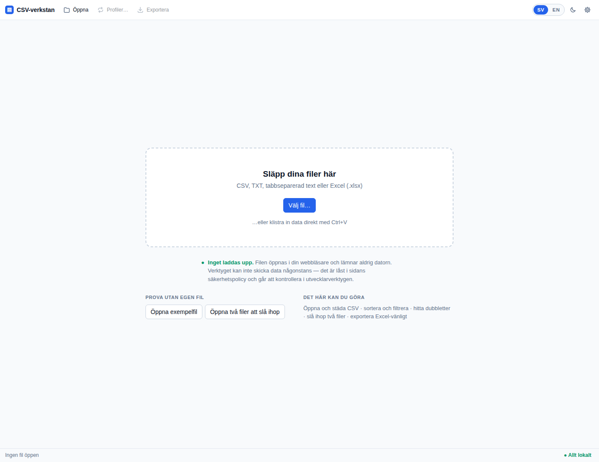

Släpp en fil var som helst i fönstret, eller klicka **Välj fil…**. Vill du bara prova finns **Öppna exempelfil** — sexton rader stökig svensk data där varje verktyg har något att bita i.

Två saker är värda att veta innan du börjar:

- **Inget lämnar datorn.** Filen öppnas i webbläsaren och stannar där. Sidan får inte ens göra ett nätverksanrop.
- **Inget ändras utan att du ser resultatet först.** Varje verktyg visar siffror och exempel innan det körs, och `Ctrl+Z` tar tillbaka.

### Så ser skärmen ut

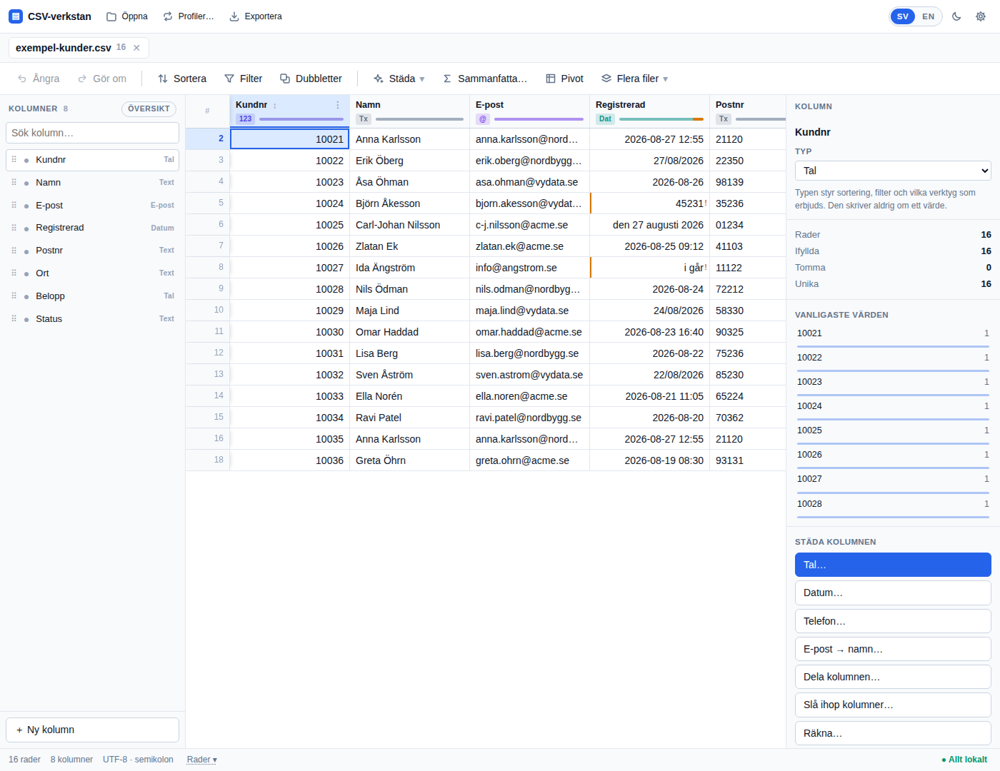

1. **App-raden** överst bär filens ärenden: öppna, profiler, exportera. Längst till höger ligger språkval, ljust/mörkt läge och kugghjulet.
2. **Flikraden** — en flik per öppen fil.
3. **Redigeringsfältet** — ångra och gör om, sedan det som ändrar vyn (sortera, filter, dubbletter), sedan det som skapar data (städa, sammanfatta, pivot, flera filer).
4. **Kolumnlistan** till vänster: sök, dölj och dra om kolumner.
5. **Tabellen** i mitten, med **panelen** till höger — inspektören, eller det verktyg du öppnat.
6. **Statusraden** nederst: antal rader, sortering, snabbsumma för markeringen.

---

## Öppna och exportera

### Öppna en fil

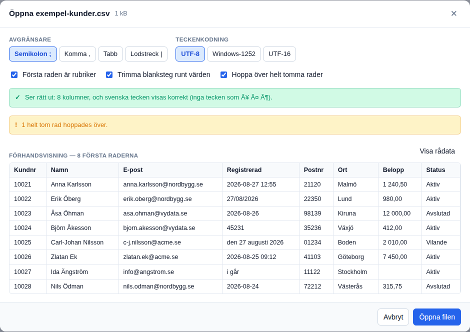

Öppnar CSV, TXT, TSV och Excel (`.xlsx`). Flera filer samtidigt blir flera flikar.

1. Släpp filen i fönstret, eller **Öppna** i app-raden.
2. Dialogen visar sin gissning av teckenkodning och avgränsare, med en förhandsvisning. Ändra om den gissat fel.
3. **Öppna filen**.

- Har filen svenska tecken säger dialogen rakt ut om de ser rätt ut. Gör de inte det, prova en annan teckenkodning.
- Trasiga rader, dubbletta rubriker och Excels `sep=;`-rad rapporteras i stället för att försvinna tyst.
- En Excel-arbetsbok med flera blad låter dig välja blad. Datum blir `ÅÅÅÅ-MM-DD` och tal får det decimaltecken du väljer.

### Exportera

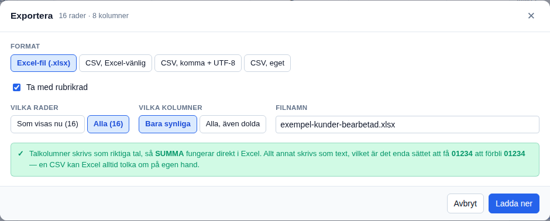

1. **Exportera** i app-raden, eller `Ctrl+S`.
2. Välj format: **Excel-fil (.xlsx)**, **CSV, Excel-vänlig**, **CSV, komma + UTF-8** eller **CSV, eget**.
3. Välj om **alla rader** eller bara de som visas ska med, och om dolda kolumner ska följa med.
4. **Exportera**.

- Excel är förvalt: det är det enda formatet som både behåller `01234` som `01234` och skriver talkolumner som riktiga tal, så att `SUMMA` fungerar.
- Väljer du **CSV, eget** får du styra avgränsare, teckenkodning, BOM och radslut var för sig.

### Klistra in som en ny fil

Har du kopierat en hel tabell någon annanstans ifrån öppnar `Ctrl+Skift+V` den som en egen flik i stället för att skriva in den i tabellen du står i.

- `Ctrl+C` kopierar markeringen som TSV, alltså det Excel förstår. `Ctrl+V` klistrar in TSV eller CSV.
- Är det inklistrade större än markeringen frågar verktyget om det ska lägga till plats, klippa av, eller öppna som en egen fil. Det klipper aldrig av i tysthet.

---

## Tabellen

### Sortera

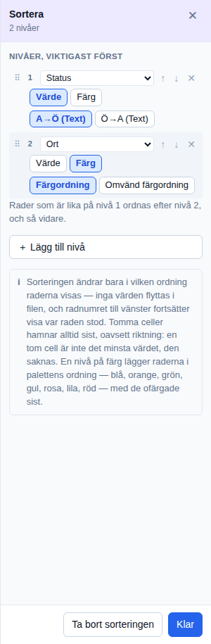

Flernivåsortering med svensk ordning: `Öberg` efter `Zetterlund`, och `Kund 2` före `Kund 10`.

1. Klicka på pilen i en kolumnrubrik. Skift-klicka i nästa rubrik för att lägga till en nivå till.
2. Eller öppna **Sortera** i redigeringsfältet och bygg listan där — nivåerna går att dra om.

- Talkolumner sorteras numeriskt och datumkolumner som datum, oavsett hur de är skrivna. Tomma celler hamnar alltid sist, åt båda hållen.
- Rättar du en cell efter att ha sorterat ligger raden kvar under markören. Statusraden erbjuder **Sortera om** när du är klar.

### Filter

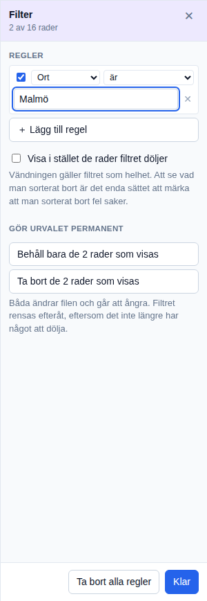

Ett filter är en lista med regler. Varje regel går att stänga av utan att tas bort.

1. **Filter** i redigeringsfältet → **＋ Lägg till regel**.
2. Välj kolumn, operator och värde. Reglerna visas som chips ovanför tabellen.
3. Välj om **alla regler måste stämma** eller om **någon räcker**.

- Operatorerna följer kolumnens typ: storleksjämförelser och `mellan` finns bara på tal och datum.
- **Visa i stället de rader filtret döljer** vänder urvalet — det enklaste sättet att upptäcka att du sorterat bort fel saker.
- När urvalet stämmer gör **behåll bara de som visas** eller **ta bort de som visas** det permanent. Båda går att ångra.
- En tom cell matchar bara `är tom`. Den är inte ”inte Malmö”, den är okänd.

### Dubbletter

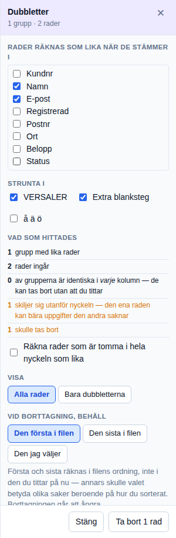

Hittar rader som är lika i de kolumner du väljer — nästan alltid det du vill, eftersom två poster om samma person brukar skilja sig på ett löpnummer eller ett datum.

1. **Dubbletter** i redigeringsfältet.
2. Kryssa i de kolumner som avgör vad som är samma rad.
3. Panelen säger hur många grupper som hittades och hur många rader en rensning skulle ta bort — innan du kör.
4. Välj vilken rad som ska stanna och **Ta bort**.

- **Strunta i** VERSALER, extra blanksteg och å ä ö vid jämförelsen om skrivsätten varierar.
- Borttagningen behåller den första eller den sista raden **i filens ordning**, inte i den du råkar titta på.
- Skiljer sig raderna i andra kolumner kan du välja **den jag väljer** och ringa in den rad som ska stanna, grupp för grupp.

### Sök

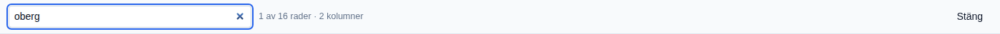

`Ctrl+F` söker accentokänsligt: `oberg` hittar `Öberg`. Träffarna markeras och räknas.

### Ångra och gör om

`Ctrl+Z` ångrar, `Ctrl+Y` gör om — på allt. Kolumnpanelen har en steglista där du kan backa till vilket steg som helst.

Ett verktyg som körts över flera kolumner backas som ett enda steg.

---

## Städa och skriva om

De åtta panelverktygen ligger i **kolumnmenyn** (klicka `⋮` i rubriken, eller högerklicka), i **cellmenyn** och i kommandopaletten. Menyn sätter de verktyg som passar kolumnens innehåll överst, med sitt skäl utskrivet; resten ligger under **Fler verktyg**.

Alla panelerna fungerar likadant: de ligger **bredvid** tabellen, ritar förslaget i dina egna celler medan du ställer in, och ändrar ingenting förrän du klickar **Tillämpa**. `Bara ändrade` och `Bara problem` filtrerar fram just de raderna. `Ctrl+Z` tar tillbaka.

Datum, tal, telefon och sök & ersätt kör över **hela markeringen**: markera tolv månadskolumner, högerklicka och kör en gång.

### Snabbstädning av text

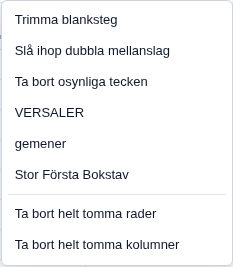

Sex åtgärder utan panel, direkt på markeringen. **Städa ▾** i redigeringsfältet.

| Åtgärd | Gör |
| --- | --- |
| Trimma blanksteg | Tar bort blanksteg först och sist |
| Slå ihop dubbla mellanslag | Flera mellanslag blir ett |
| Ta bort osynliga tecken | Nollbreddstecken, hårda mellanslag, uppdelade bokstäver |
| VERSALER · gemener · Stor Första Bokstav | Ändrar skiftläge — Anna-Lena och O'Brien klarar sig |

I samma meny ligger **Ta bort helt tomma rader** och **Ta bort helt tomma kolumner**.

### Datum

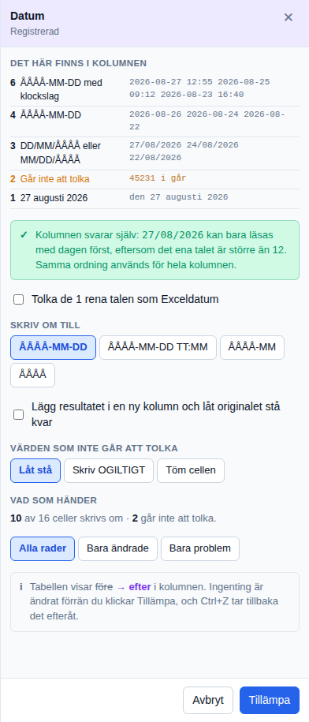

Skriver om blandade datumformat till ett enda.

1. Kolumnmenyn → **Datum…**
2. Panelen listar de format kolumnen faktiskt innehåller, med antal och exempel ur din fil.
3. Välj **Skriv om till**, t.ex. `ÅÅÅÅ-MM-DD`. Tabellen visar `före → efter` direkt.
4. **Tillämpa**.

- `03/04/2026` kan vara 3 april eller 4 mars. Verktyget letar först efter bevis i kolumnen och frågar bara när inget finns.
- Exceldatum som ligger kvar som serienummer (`45231`) tolkas bara om du kryssar i det.
- Kryssa i **Lägg resultatet i en ny kolumn** om du vill behålla både `2026-08-27 12:55` och `2026-08-27`.
- Rader som inte går att tolka kan lämnas som de är, skrivas `OGILTIGT` eller tömmas — du väljer.

### Tal

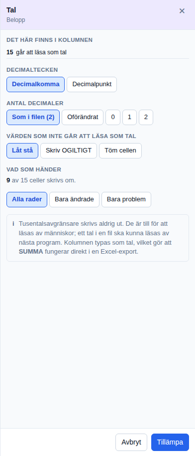

Gör text som ser ut som tal till riktiga tal.

1. Kolumnmenyn → **Tal…**
2. Välj **decimalkomma** eller **decimalpunkt**, och hur många decimaler.
3. **Tillämpa**.

- Skalar av `kr`, `%` och tusentalsavgränsare, och läser bokföringens `(1 240,50)` och `1240–` som negativa tal.
- Punktens tvetydighet hanteras som datumens: är `1.234` ett decimaltal eller ett tusental? Bevis först, fråga sedan.
- Kolumnen blir typad som tal, så sorteringen går den numeriska vägen och Excel-exporten skriver riktiga tal.

### Telefon

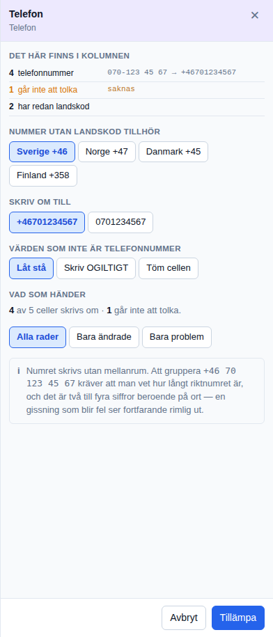

Normaliserar telefonnummer så att de går att jämföra mellan filer.

1. Kolumnmenyn → **Telefon…**
2. Välj vilket land nummer utan landskod tillhör.
3. Välj `+46701234567` eller `0701234567`, och **Tillämpa**.

- Ingen snygg gruppering med mellanslag — riktnumrets längd varierar, och en gissning som blir fel ser rimlig ut.

### E-post till namn

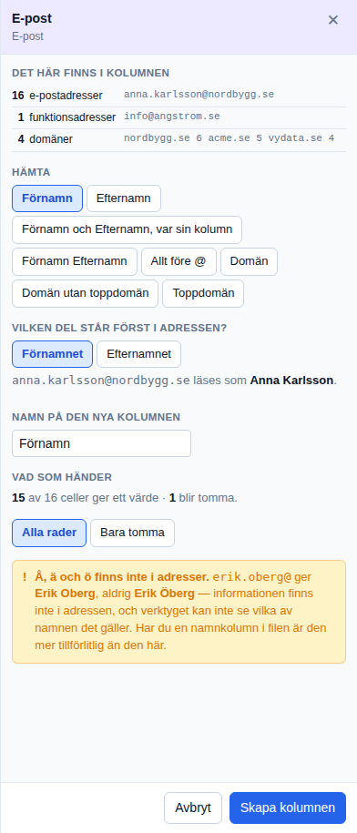

Plockar ut namn- och domändelar ur en adress, som **nya** kolumner bredvid.

1. Kolumnmenyn → **E-post → namn…**
2. Välj vad du vill ha under **Hämta**: förnamn, efternamn, båda som var sin kolumn, `Förnamn Efternamn`, domän, domän utan toppdomän eller toppdomän.
3. **Skapa kolumnen**.

- Funktionsadresser som `info@` blir inte personer.
- Å, ä och ö går inte att få tillbaka ur en adress. Panelen säger det rakt ut.

### Dela en kolumn

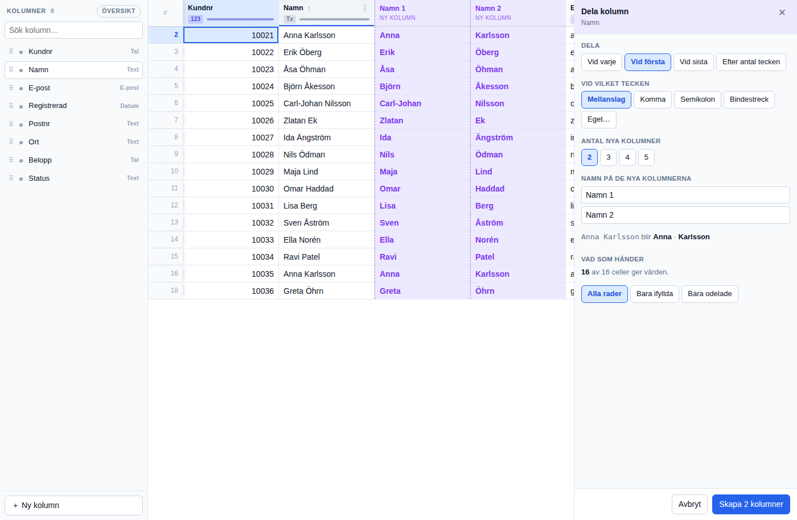

Delar en kolumn i flera nya. De nya kolumnerna ritas som spökkolumner med streckad ram innan de skapas.

1. Kolumnmenyn → **Dela kolumnen…**
2. Välj var delningen sker: **vid varje**, **vid första**, **vid sista** förekomsten av ett tecken, eller **efter antal tecken**.
3. Välj tecken och antal nya kolumner, och klicka **Skapa 2 kolumner**.

- **Vid sista** mellanslaget håller ihop dubbelnamn: `Anna Karlsson` och `Carl-Johan Nilsson` delas lika.
- Det som inte får plats hamnar i sista kolumnen i stället för att försvinna. Panelen varnar när det händer.

**Efter ett mönster** är det femte sättet, och det är mallen baklänges. Skriv värdet som det ser ut och sätt klamrar runt det du vill plocka ut:

| Mönster | `last1 first1 <last1.first1@exempel.com>` blir |
| --- | --- |
| `{Namn} <{E-post}>` | Namn = `last1 first1` · E-post = `last1.first1@exempel.com` |

Texten mellan klamrarna är avgränsarna, och varje klammer blir en kolumn med sitt eget namn. Att den avslutande texten måste sitta i slutet är det som städar bort `<>` på köpet — inget reguljärt uttryck behövs.

- Ett värde som inte matchar mönstret ger tomma celler och räknas som ett problem. **Bara omatchade** filtrerar fram just dem, och källkolumnen står kvar orörd, så ingenting tappas.
- Avgränsare inuti söks från vänster, precis som **Vid första**.

### Dela till rader

Delar en kolumn på höjden i stället för på bredden: en rad per del. Adresser klistrade ur Outlook ligger som `a <x@y>; b <z@w>; c <q@r>` i en enda cell, och de är inte tre fält på en person — de är tre personer.

1. Kolumnmenyn → **Dela till rader…**
2. Välj vid vilket tecken, och klicka **Skapa ny flik med 48 rader**. Antalet står på knappen.

- Resultatet blir en **ny flik**. Originalfliken rörs inte, och övriga kolumners värden följer med ner på de nya raderna.
- Delningen går på **det du ser**: har du filtrerat är det de raderna som delas, och panelen säger det.
- En cell utan avgränsare ger en oförändrad rad. Ingen rad försvinner för att en cell var tom.
- Åt andra hållet finns **Gruppera och summera** med beräkningen *lista*, som radar upp gruppens värden på en rad. Den kapar vid 50 värden och skriver ut hur många fler det fanns, så en kapad lista aldrig ser ut som en fullständig.

Klistrar du in listan som en egen fil gissar importen på semikolon — rätt gissning för en CSV, fel för en adresslista där semikolonen skiljer *personer* och inte *fält*. Välj **Lodstreck** i importdialogen, så håller raden ihop. Det är den enda platsen valet går att göra: efteråt är den redan delad.

### Bygg kolumn ur mall

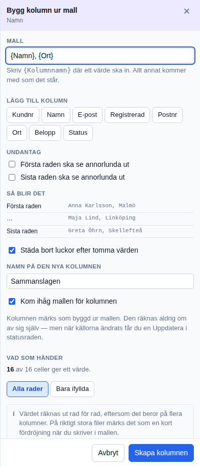

Bygger en ny kolumn ur en mall. Två saker i ett: mallen slår ihop kolumner, och den lägger en struktur runt varje värde.

- **Mallen du sist körde ligger kvar.** Fältet är förifyllt med den, och under det ligger **Senast använda** — de åtta senaste som klickbara knappar. Listan sparas i webbläsaren och överlever en omladdning; *Börja om* tömmer den. Nämner den senaste en kolumn den här filen saknar fylls den inte i, men den finns kvar som knapp.

1. Kolumnmenyn → **Bygg kolumn ur mall…**
2. Skriv mallen, t.ex. `{Förnamn} {Efternamn}` eller `('{Användarnamn}'),`. **Lägg till kolumn** sätter in ett namn åt dig.
3. **Skapa kolumnen**.

Allt som inte står inom klamrar kommer med som det står, så mallen bygger lika gärna en rad SQL, en PowerShell-array eller en JSON-lista som ett fullständigt namn.

- Kolumnnamn som inte finns rapporteras som ett fel i stället för att tyst bli tomma.
- **Städa bort luckor efter tomma värden** tar bort de dubbla mellanslag som annars uppstår när ett fält är tomt.

**Första och sista raden kan se annorlunda ut.** En SQL-lista behöver `('Anna'),` på varje rad utom den sista, som ska sakna kommatecknet. Kryssa i **Sista raden ska se annorlunda ut**, så fylls fältet med huvudmallen och du ändrar bara slutet. Rutan **Så blir det** visar första, mitten- och sista raden ur din egen fil, så undantaget syns utan att du behöver scrolla till botten.

Första och sista raden räknas i **den ordning du ser nu**. Det är samma ordning som kopieras med `Ctrl+C`, vilket är hela poängen: en fysisk tolkning hade satt kommatecknet på den sista kopierade raden.

**Kolumnen minns sin mall.** Med **Kom ihåg mallen för kolumnen** ikryssat får rubriken märket `mall`. Kolumnen räknas **aldrig** om av sig själv — men när källorna ändrats blir märket gult och statusraden erbjuder **Uppdatera**, precis som *Sortera om* gör för en sorterad lista. Uppdateringen är ett enda `Ctrl+Z`.

- Kolumnmenyn har **Uppdatera ur mallen**, **Ändra mallen…** och **Stäng av mallen** när kolumnen har en.
- **En avstängd mall kastas inte.** Märket bleknar till en streckad ram, statusraden tystnar, och kolumnen slutar följa sina källor — men mallen ligger kvar. **Slå på mallen igen** i kolumnmenyn tar tillbaka den, också i morgon och också efter en omladdning. `Ctrl+Z` hjälper bara den som märker misstaget direkt.
- Döper du om en källkolumn följer mallen med, i samma ångra-steg.
- Tar du bort en källkolumn säger märket ifrån i stället för att kolumnen fylls med halva värden. `Ctrl+Z` väcker den till liv igen.

### Räkna

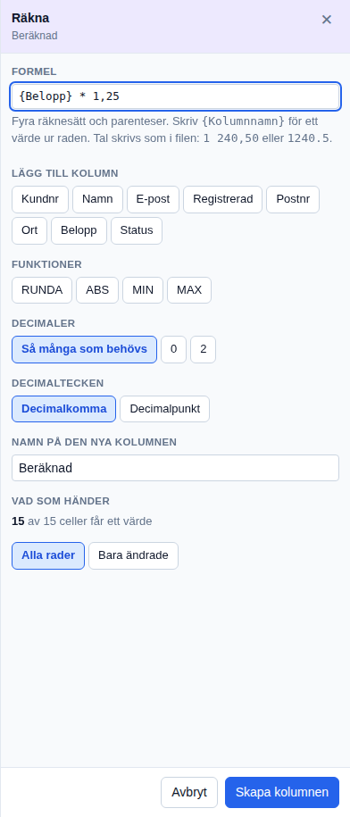

En ny kolumn ur en formel.

1. Kolumnmenyn → **Räkna…**
2. Skriv formeln, t.ex. `{Antal} * {Pris}`, `RUNDA({Belopp} * 1,25; 2)` eller `{Slut} - {Start}`.
3. Välj decimaler och decimaltecken, och **Skapa kolumnen**.

- Fyra räknesätt, parenteser och funktionerna `RUNDA`, `ABS`, `MIN`, `MAX`. Felet i formeln visas medan du skriver.
- Tal skrivs som i filen: `1 240,50` fungerar lika bra som `1240.5`.
- En datumkolumn räknas som antal dagar, så `{Slut} - {Start}` ger skillnaden i dagar.
- Tomma celler, text som inte är tal och division med noll ger **tomt, inte noll**. En lucka går att se; en felaktig nolla gör det inte.

### Sök och ersätt

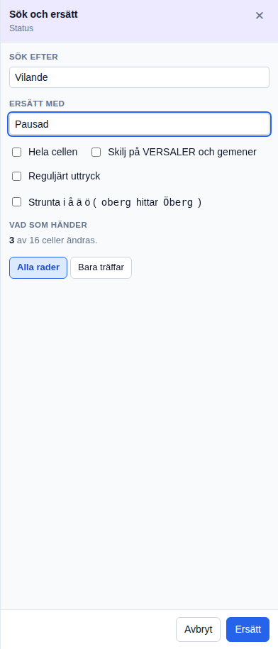

1. Kolumnmenyn → **Sök och ersätt…**
2. Skriv vad som ska sökas och vad det ska bli.
3. **Tillämpa**.

- Bokstavlig sökning är bokstavlig: `1.5` matchar inte `125`.
- Kryssa i **Reguljärt uttryck** för mönster. Felet visas medan du skriver.
- **Hela cellen** ersätter bara när hela värdet stämmer, inte en del av det.

---

## Sammanfatta och analysera

### Gruppera och summera

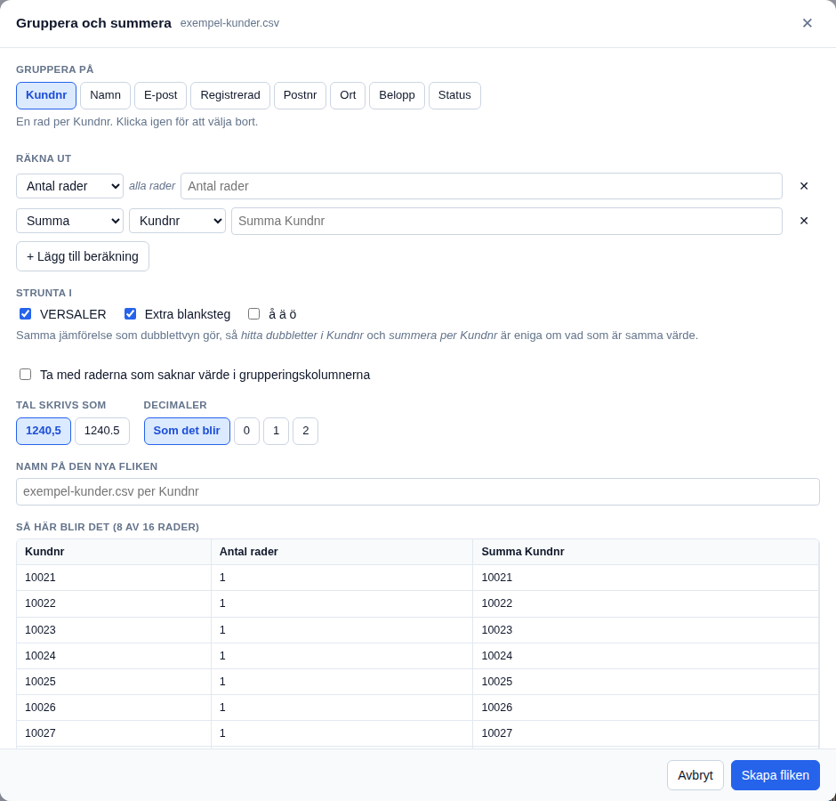

*Summa Belopp per Ort*, *antal ordrar per kund*, *första och sista datum per projekt* — en rad per grupp.

1. **Sammanfatta…** i redigeringsfältet.
2. Välj kolumnerna att **gruppera på**.
3. Lägg till beräkningarna: antal rader, summa, snitt, minsta, största, antal ifyllda, antal unika, första, sista eller värdena uppradade.
4. Rutan **Så här blir det** visar resultatet medan du ställer in. **Skapa fliken**.

- Resultatet blir en **ny flik**. Originalet rörs inte.
- Grupperingen går på **det du ser**: har du filtrerat till 2024 är summan 2024 års summa.
- En summa utan läsbara tal blir **tom, inte noll**.
- Rader som saknar värde i grupperingskolumnerna räknas inte in i någon grupp — de rapporteras, och kan tas med som en egen grupp om du vill.

### Pivot

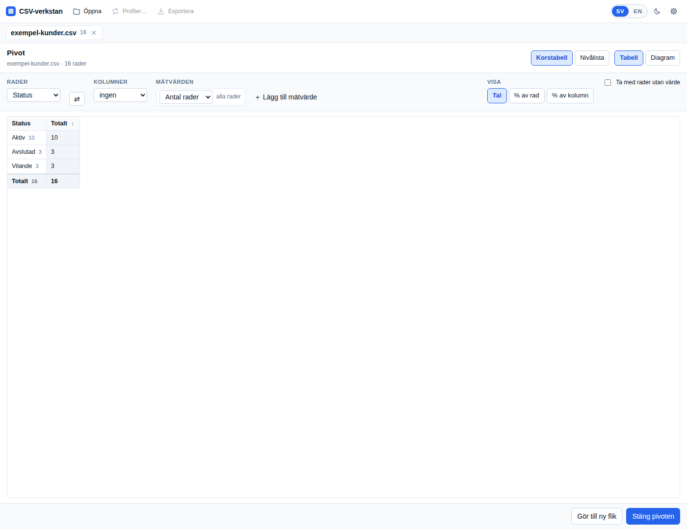

*Antal ordrar per Ort och Status* i en korstabell. En **egen vy** som aldrig rör datat.

1. **Pivot** i redigeringsfältet. Vyn öppnas med en tabell som redan säger något.
2. Välj dimension för **rader** och för **kolumner**. **⇄** byter håll.
3. Välj **mätvärden** — antal, summa, snitt, minsta, största, ifyllda, unika. Flera går att ha sida vid sida.
4. **Gör till ny flik** om du vill sortera, filtrera eller exportera svaret.

- **Nivålista** är samma beräkning ordnad åt ett håll i stället, med delsummor på varje nivå som går att fälla ihop.
- **Visa** växlar mellan tal, *% av rad* och *% av kolumn*. Andelen erbjuds bara för mätvärden som går att lägga ihop — ett snitt är ingen del av ett annat snitt.
- Klick på en kolumnrubrik sorterar raderna efter just den kolumnen.
- Pivoten räknar på **hela filen** som förval; kryssa i **bara de som visas nu** för att följa filtret.

### Kolumnöversikt

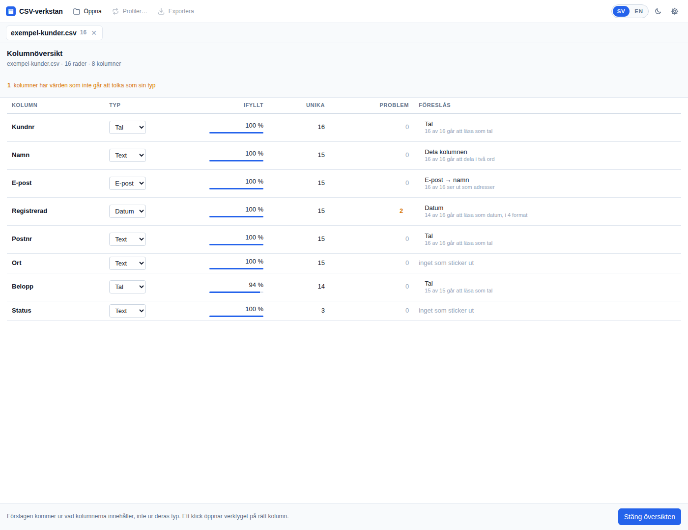

Svarar på frågan man ställer innan man börjar: *vad är det här för fil?*

1. **Översikt** ovanför kolumnlistan.
2. En rad per kolumn med typ, ifyllnad, unika värden och problem.
3. Klicka ett förslag i högerkanten — då öppnas rätt verktyg på rätt kolumn.

### Kolumninspektören

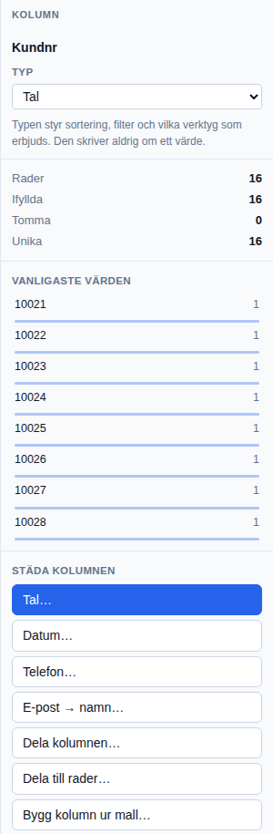

Panelen till höger när inget verktyg är öppet. Visar den kolumn markören står i: antal ifyllda, tomma, unika och otolkbara värden, plus de vanligaste värdena.

- **Visa de N raderna** filtrerar fram just de problematiska raderna.
- Härifrån går det också att byta typ, byta namn, duplicera och ta bort kolumnen.

---

## Flera filer

De tre sätten att sätta ihop data ur flera filer ligger under **Flera filer ▾** i redigeringsfältet. Öppna filerna som var sin flik först.

### Slå ihop två filer

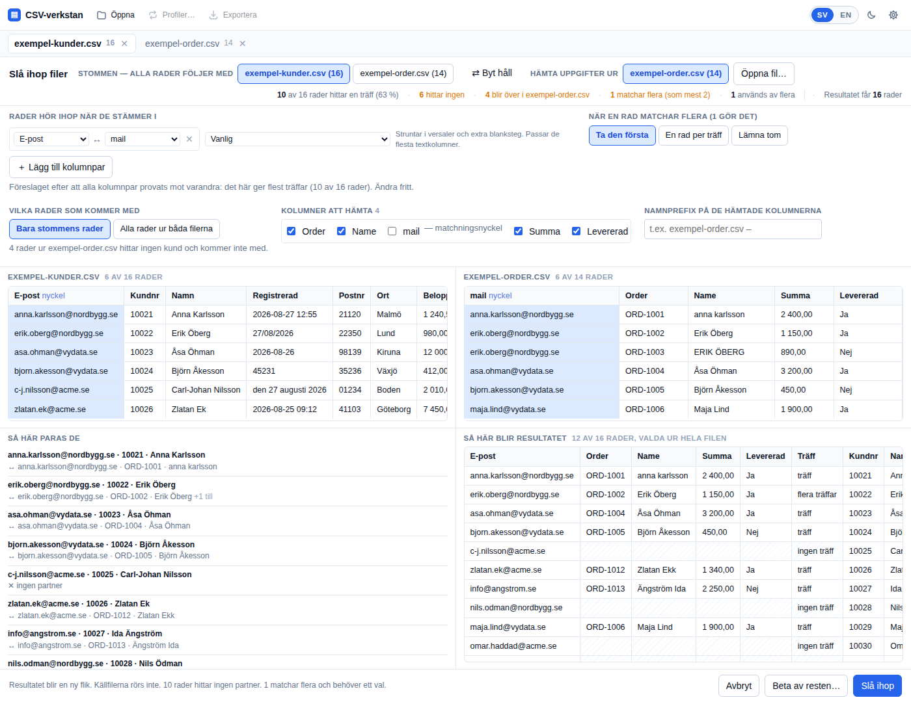

Lägger rader som hör ihop sida vid sida, matchat på en nyckel — som `LETARAD`, fast med facit synligt.

1. **Flera filer ▾ → Slå ihop…**
2. Verktyget har redan provat alla kolumnpar mot varandra och föreslagit det som ger flest träffar. Ändra fritt, eller **＋ Lägg till kolumnpar**.
3. Läs siffrorna överst: hur många rader som hittar en träff, hur många som blir över, hur många som matchar flera.
4. Kryssa i **kolumner att hämta**, och **Slå ihop**.

- Vyn visar fyra saker samtidigt medan du ställer in: de två källfilerna med den normaliserade nyckeln under varje värde, hur raderna paras ihop, och hur resultatet blir. Förhandsvisningens rader blandar träffar och missar i den proportion de faktiskt har.
- Resultatet blir en **ny flik** med en **Träff**-kolumn: `träff`, `ingen träff` eller `flera träffar`. Den gör de omatchade raderna filtrerbara efteråt.
- **Vilka rader som kommer med** avgör om bara stommens rader följer med eller alla rader ur båda filerna.
- Jämförelsen kan vara vanlig, teckenexakt, utan å ä ö, bara siffror, e-post mot namn, eller namn mot förnamn + efternamn. **Tomma nycklar matchar aldrig.**
- `⇄ Byt håll` byter vilken fil som är stomme.

### Matchningsverkstaden

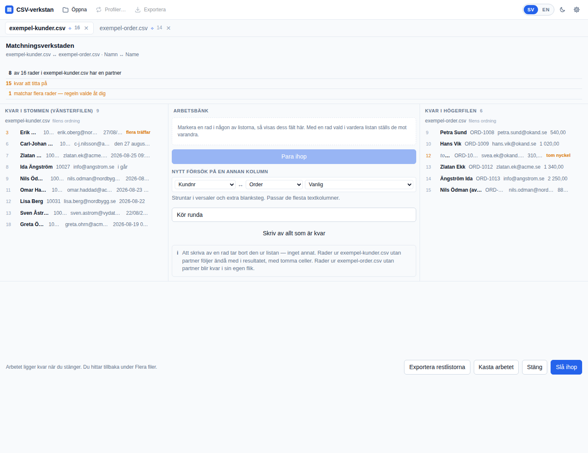

För raderna som blev över. En sammanslagning slutar aldrig på hundra procent.

1. **Beta av resten…** i sammanslagningsvyn — eller **Fortsätt** på chipet i statusraden när du kommer tillbaka senare.
2. De omatchade raderna ligger som två listor. Klicka en rad i varje och jämför dem fält för fält på arbetsbänken.
3. Fyra vägar ut: **Para ihop** för hand, rätta ett värde på plats så att raden hittar sin partner själv, **nytt försök på en annan kolumn**, eller **skriv av** raden.
4. **Slå ihop** när du är nöjd. Varje omgång lägger sitt resultat i en **egen** flik.

- **Luddig likhet** finns bara här, aldrig över hela filen. Poängen visas som två tal — stavning och ordning — så att den säger *varför*.
- Restlistan skiljer på en rad utan partner, en rad vars nyckel är tom, och en rad som matchar flera och behöver ett val.
- Arbetet överlever att du stänger vyn och att du laddar om sidan. **Exportera restlistorna** ger en CSV per fil att skicka vidare.

### Kombinera filer

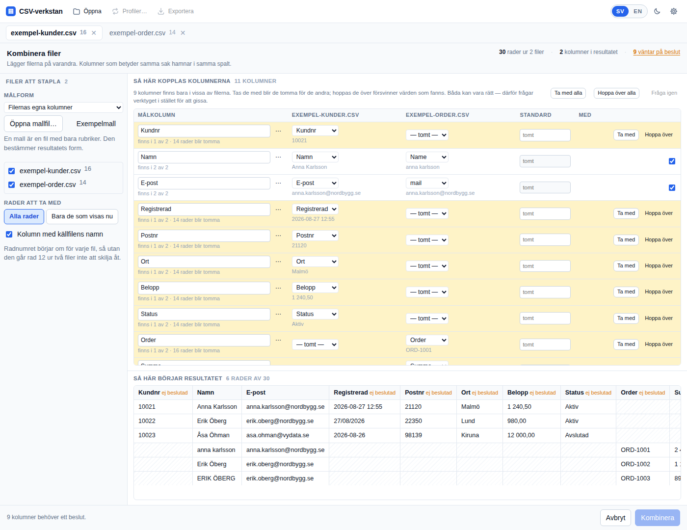

Lägger filer **på varandra**. Tolv månadsfiler, tre säljares kundlistor — samma sorts data, men rubrikerna heter olika.

1. **Flera filer ▾ → Kombinera…**
2. Aliaskartan visar en rad per målkolumn och en spalt per fil, och har redan gissat ihop `Namn`, `Name` och `kundnamn`.
3. Kolumner som bara finns i vissa filer måste **beslutas** — **Ta med** eller **Hoppa över**, en och en eller allihop på en gång.
4. **Kombinera**.

- Under varje källväljare står ett av kolumnens värden, eftersom rubriker ljuger: `Kontakt` kan vara ett namn i den ena filen och en adress i den andra.
- Gissar verktyget fel finns **Samma spalt som…** på raden.
- Ett **standardvärde** fyller de filer som inte ger något — `Okänd` där kolumnen saknas. Bara där: en cell som finns men är tom rörs aldrig.
- En kolumn med källfilens namn följer med som förval, eftersom radnumret börjar om för varje fil.

### Fyll en mall med data

Samma vy som **Kombinera**, men formen kommer ur en **mallfil**: ett dokument med bara rubriker.

1. **Flera filer ▾ → Fyll en mall med data…**
2. Öppna mallfilen, eller använd **Exempelmall**.
3. Peka ut var varje målkolumn ska hämta sitt värde, och kör.

- Mallen bestämmer vilka kolumner resultatet har, vad de heter och i vilken ordning de kommer.
- Exempelrader i mallen följer aldrig med, men visas som ledtråd i kartan.
- Kolumner som finns i filerna men inte i mallen kastas inte i tysthet — de frågas om.

---

## Spara arbetet

### Profiler

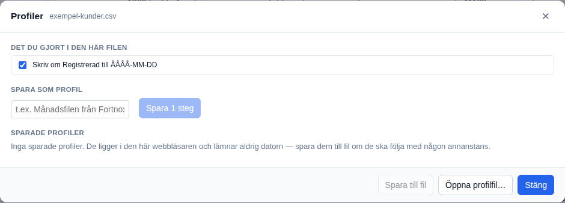

Samma exportfil kommer varje månad, och samma tio handgrepp behöver göras om. En profil är listan över de handgreppen.

1. **Profiler…** i app-raden.
2. Dialogen visar vad du gjort i den här filen. **Spara som profil** med ett namn.
3. Öppna nästa månads fil och tryck **Kör** på profilen.

- Kolumner matchas på **namn**, eftersom ett kolumn-id inte betyder något i en annan fil. Hittar ett steg inte sin kolumn säger det ifrån.
- Bara det som går att upprepa kommer med. En handredigerad cell eller en borttagen rad pekar på just den filens rader och står gråmarkerad med sitt skäl.
- Efter körningen står det steg för steg vad som hände. `Ctrl+Z` backar ett steg i taget.
- **Spara till fil** om profilen ska följa med någon annanstans.

### Flikarna finns kvar

Filerna du har öppna sparas i din egen webbläsare — med sortering, filter, dubblettvy och markering — och kommer tillbaka nästa gång du öppnar sidan. En stängd flik glöms direkt.

- **Ångra-historiken följer inte med.** Verktyget säger till om det när flikarna kommer tillbaka.
- **Glöm sparade filer** i kommandopaletten tömmer det sparade men låter flikarna stå kvar.

### Börja om

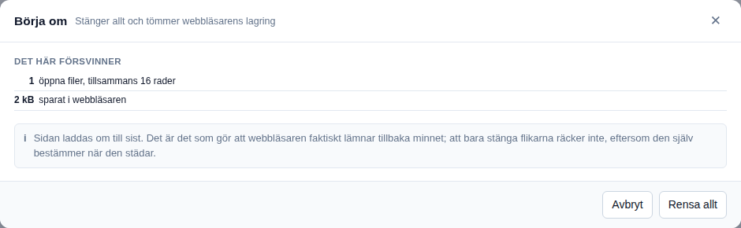

När du är klar: klicka **● Allt lokalt** i statusraden.

1. Dialogen räknar upp vad som finns — öppna filer med radantal, en påbörjad sammanslagning, och hur många byte webbläsaren sparat.
2. Filer med ändringar som inte exporterats listas särskilt.
3. **Rensa allt.** Sidan laddas om.

Det här är en av få åtgärder som **inte** går att ångra.

---

## Genvägar och inställningar

### Kommandopaletten

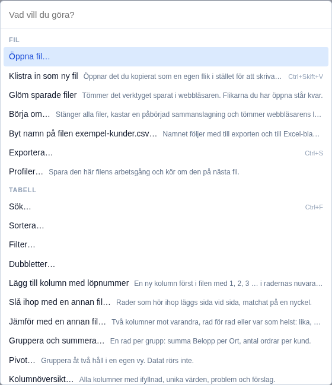

`Ctrl+K` öppnar paletten. Den är vägen för den som vet *vad* hen vill göra men inte var knappen sitter.

- Sökningen är bokstavlig och accentokänslig, och hittar även på engelska: `undo`, `join`, `makro`.
- Kolumnkommandona gäller den kolumn markören står i och står med kolumnens namn utskrivet.

### Tangentbord

| Genväg | Gör |
| --- | --- |
| `Ctrl+K` | Kommandopaletten |
| `Ctrl+F` | Sök |
| `Ctrl+S` | Exportera |
| `Ctrl+Z` · `Ctrl+Y` | Ångra · Gör om |
| `Enter` · `F2` · dubbelklick | Redigera cellen |
| `Skift`+piltangenter | Utöka markeringen |
| `Ctrl+D` | Fyll nedåt |
| `Delete` | Töm markeringen |
| `Ctrl+C` · `Ctrl+V` | Kopiera · Klistra in (TSV, som Excel) |
| `Ctrl+Skift+V` | Klistra in som en ny fil |
| `F2` i rubriken | Byt namn på kolumnen |
| Menytangenten | Öppnar menyn vid markeringen |

### Språk, tema och verktygsfält

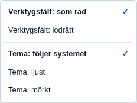

Längst till höger i app-raden: språkvalet `SV | EN`, ljust/mörkt läge och kugghjulet.

- **Språk** byter bara etiketterna. Sorteringen är fortfarande svensk, tal skrivs fortfarande `1 240,50` och datumverktyget läser fortfarande `augusti` — annars hade samma fil sorterad på två språk gett två ordningar.
- **Tema** kan följa systemet, eller låsas till ljust eller mörkt.
- **Verktygsfältet** kan ligga som en rad under flikarna eller lodrätt till vänster om kolumnerna. Valet sparas.
