# User guide

How to use CSV-verkstan, one tool at a time. Each section says what the tool does, how to run it and what is worth knowing — nothing more.

[← Back to the README](../README.md) · [På svenska](ANVANDARGUIDE.md)

## Contents

| Area | Sections |
| --- | --- |
| **[1. Getting started](#getting-started)** | [What the screen looks like](#what-the-screen-looks-like) |
| **[2. Opening and exporting](#opening-and-exporting)** | [Open a file](#open-a-file) · [Export](#export) · [Paste as a new file](#paste-as-a-new-file) |
| **[3. The table](#the-table)** | [Sort](#sort) · [Filter](#filter) · [Duplicates](#duplicates) · [Search](#search) · [Undo and redo](#undo-and-redo) |
| **[4. Cleaning and rewriting](#cleaning-and-rewriting)** | [Quick text cleanups](#quick-text-cleanups) · [Dates](#dates) · [Numbers](#numbers) · [Phone numbers](#phone-numbers) · [Email to name](#email-to-name) · [Split a column](#split-a-column) · [Merge columns](#merge-columns) · [Calculate](#calculate) · [Find and replace](#find-and-replace) |
| **[5. Summarising and analysing](#summarising-and-analysing)** | [Group and summarise](#group-and-summarise) · [Pivot](#pivot) · [Column overview](#column-overview) · [The column inspector](#the-column-inspector) |
| **[6. Multiple files](#multiple-files)** | [Merge two files](#merge-two-files) · [The matching workbench](#the-matching-workbench) · [Combine files](#combine-files) · [Fill a template with data](#fill-a-template-with-data) |
| **[7. Keeping your work](#keeping-your-work)** | [Profiles](#profiles) · [Your tabs come back](#your-tabs-come-back) · [Start over](#start-over) |
| **[8. Shortcuts and settings](#shortcuts-and-settings)** | [The command palette](#the-command-palette) · [Keyboard](#keyboard) · [Language, theme and toolbar](#language-theme-and-toolbar) |

> The guide is also available as a **[page](https://timpan8.github.io/CSV-Tool/guide/?sprak=en)** — sidebar, search box, Swedish/English switch and screenshots that enlarge on click. After a clone, `docs/guide.html` opens straight from disk.

> **New here?** Read [Getting started](#getting-started) and [What the screen looks like](#what-the-screen-looks-like), then the section that answers your task. The guide is made to be looked things up in, not read front to back.

> The interface switches between Swedish and English with `SV | EN` in the top-right corner. **Only the labels change language, never what the tool does:** sorting still follows Swedish rules (å ä ö after z), numbers are still written `1 240,50` and the date tool still reads `augusti`. The screenshots below are from the English interface.

---

## Getting started

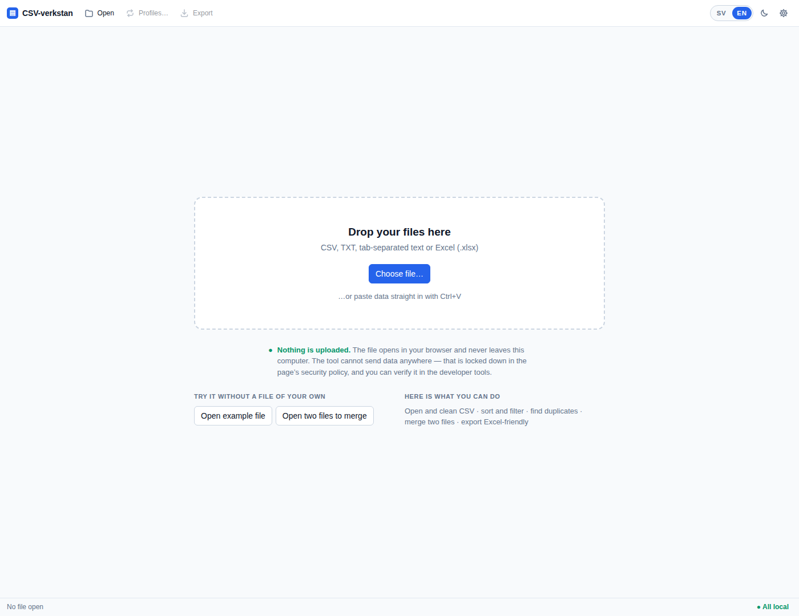

Drop a file anywhere in the window, or click **Choose file…**. To just try it out, there is **Open example file** — sixteen rows of deliberately messy Swedish data, so every tool has something to bite into.

Two things worth knowing before you start:

- **Nothing leaves your computer.** The file is opened in the browser and stays there. The page is not even allowed to make a network request.
- **Nothing changes without you seeing the result first.** Every tool shows counts and examples before it runs, and `Ctrl+Z` brings it back.

### What the screen looks like

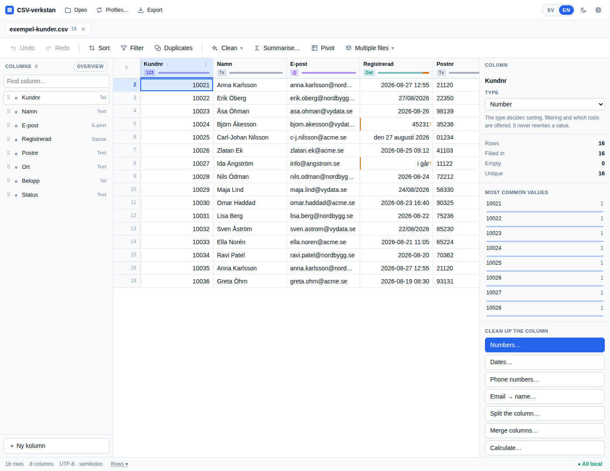

1. **The app row** at the top carries the file's errands: open, profiles, export. On the far right sit the language choice, light/dark mode and the settings gear.
2. **The tab bar** — one tab per open file.
3. **The editing toolbar** — undo and redo, then what changes the view (sort, filter, duplicates), then what creates data (clean, summarise, pivot, multiple files).
4. **The column list** on the left: search, hide and drag columns around.
5. **The table** in the middle, with **the panel** on the right — the inspector, or whichever tool you opened.
6. **The status bar** at the bottom: row count, sorting, and a quick sum for the selection.

---

## Opening and exporting

### Open a file

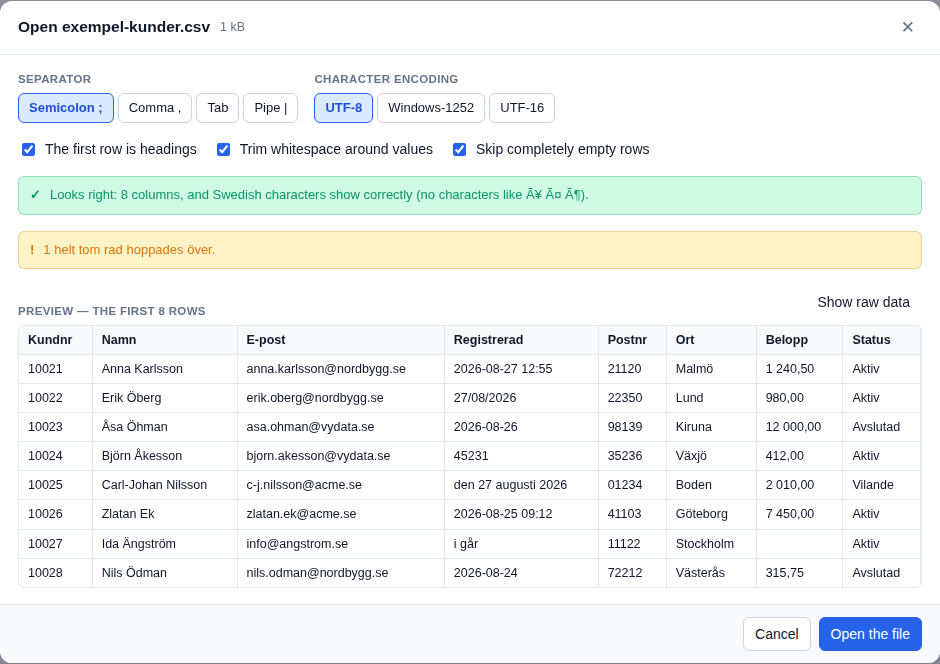

Opens CSV, TXT, TSV and Excel (`.xlsx`). Several files at once become several tabs.

1. Drop the file in the window, or click **Open** in the app row.
2. The dialog shows its guess at encoding and delimiter, with a preview. Change it if the guess is wrong.
3. **Open the file**.

- If the file contains Swedish characters, the dialog says outright whether they look right. If they don't, try another encoding.
- Broken rows, duplicate headers and Excel's `sep=;` line are reported rather than disappearing quietly.
- An Excel workbook with several sheets lets you pick a sheet. Dates become `YYYY-MM-DD` and numbers get the decimal mark you choose.

### Export

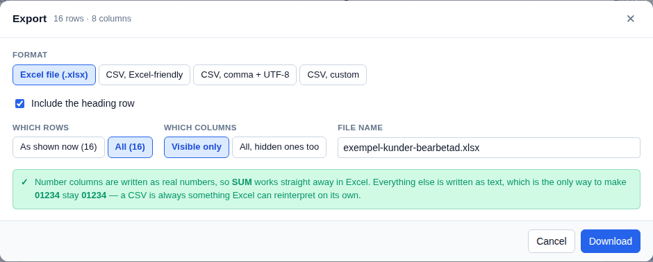

1. **Export** in the app row, or `Ctrl+S`.
2. Pick a format: **Excel file (.xlsx)**, **CSV, Excel-friendly**, **CSV, comma + UTF-8** or **CSV, custom**.
3. Choose whether **all rows** or only the ones shown come along, and whether hidden columns follow.
4. **Export**.

- Excel is the default: it is the only format that both keeps `01234` as `01234` and writes number columns as real numbers, so `SUM` works.
- **CSV, custom** lets you set delimiter, encoding, BOM and line ending separately.

### Paste as a new file

If you copied a whole table from somewhere else, `Ctrl+Shift+V` opens it as a tab of its own instead of writing it into the table you are standing in.

- `Ctrl+C` copies the selection as TSV, which is what Excel understands. `Ctrl+V` pastes TSV or CSV.
- If what you pasted is bigger than the selection, the tool asks whether to make room, cut it off, or open it as its own file. It never cuts off silently.

---

## The table

### Sort

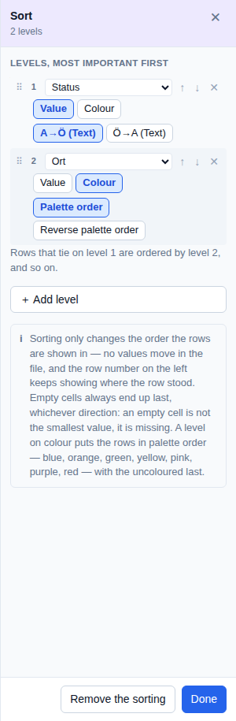

Multi-level sorting with Swedish collation: `Öberg` after `Zetterlund`, and `Kund 2` before `Kund 10`.

1. Click the arrow in a column header. Shift-click in the next header to add another level.
2. Or open **Sort** in the editing toolbar and build the list there — levels can be dragged into order.

- Number columns sort numerically and date columns as dates, however they happen to be written. Empty cells always come last, in both directions.
- If you fix a cell after sorting, the row stays put under the cursor. The status bar offers **Sort again** when you are done.

### Filter

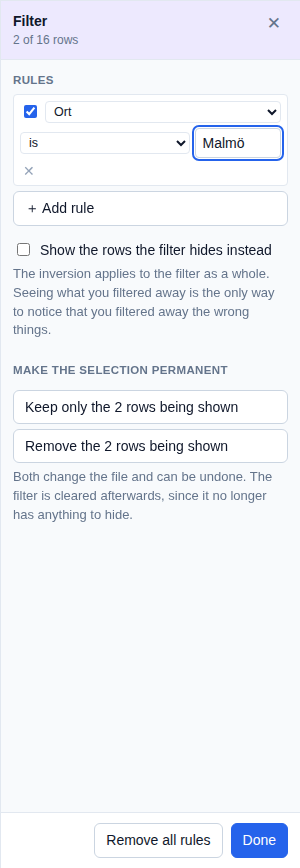

A filter is a list of rules. Each rule can be switched off without being deleted.

1. **Filter** in the editing toolbar → **＋ Add rule**.
2. Pick column, operator and value. The rules show as chips above the table.
3. Choose whether **all rules match** or whether **some rule matches** is enough.

- The operators follow the column's type: comparisons and `between` exist only on numbers and dates.
- **Show the rows the filter hides instead** inverts the selection — the easiest way to notice you filtered out the wrong things.
- When the selection is right, **keep only the ones being shown** or **remove the ones being shown** makes it permanent. Both can be undone.
- An empty cell only matches `is empty`. It is not "not Malmö", it is unknown.

### Duplicates

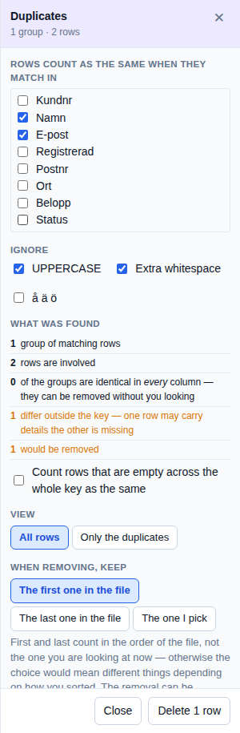

Finds rows alike in the columns you choose — almost always what you want, since two records about the same person tend to differ on a sequence number or a date.

1. **Duplicates** in the editing toolbar.
2. Tick the columns that decide what counts as the same row.
3. The panel says how many groups were found and how many rows a cleanup would remove — before you run it.
4. Choose which row stays, and remove.

- **Ignore** UPPERCASE, extra whitespace and å ä ö in the comparison when spellings vary.
- Removal keeps the first or the last row **in the file's order**, not in the one you happen to be looking at.
- If the rows differ in other columns, choose **The one I pick** and ring the row that should stay, group by group.

### Search

`Ctrl+F` searches accent-insensitively: `oberg` finds `Öberg`. Hits are highlighted and counted.

### Undo and redo

`Ctrl+Z` undoes, `Ctrl+Y` redoes — on everything. The column panel has a step list you can rewind to any point in.

A tool run across several columns is undone as a single step.

---

## Cleaning and rewriting

The eight panel tools live in the **column menu** (click `⋮` in the header, or right-click), in the **cell menu** and in the command palette. The menu puts the tools that suit the column's content at the top, with the reason spelled out; the rest sit under **More tools**.

All the panels work the same way: they sit **beside** the table, draw the proposal in your own cells while you set it up, and change nothing until you click **Apply**. `Only changed` and `Only problems` filter out exactly those rows. `Ctrl+Z` brings it back.

Dates, numbers, phone numbers and find & replace run across **the whole selection**: select twelve month columns, right-click, and run once.

### Quick text cleanups

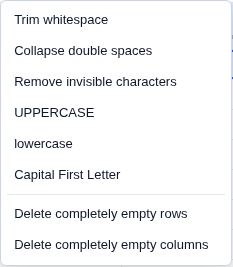

Six actions without a panel, straight onto the selection. **Clean ▾** in the editing toolbar.

| Action | Does |
| --- | --- |
| Trim whitespace | Removes spaces at the start and end |
| Collapse double spaces | Several spaces become one |
| Remove invisible characters | Zero-width characters, non-breaking spaces, decomposed letters |
| UPPERCASE · lowercase · Capital First Letter | Changes case — Anna-Lena and O'Brien survive |

The same menu holds **Delete completely empty rows** and **Delete completely empty columns**.

### Dates

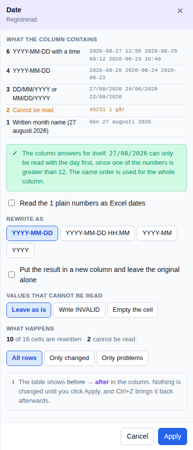

Rewrites mixed date formats into a single one.

1. Column menu → **Dates…**
2. The panel lists the formats the column actually contains, with counts and examples from your file.
3. Pick **Rewrite as**, e.g. `YYYY-MM-DD`. The table shows `before → after` straight away.
4. **Apply**.

- `03/04/2026` could be 3 April or 4 March. The tool looks for evidence in the column first and only asks when there is none.
- Excel dates still sitting there as serial numbers (`45231`) are only read as dates if you tick the box.
- Tick **Put the result in a new column** to keep both `2026-08-27 12:55` and `2026-08-27`.
- Rows that cannot be read can be left as they are, written `INVALID`, or emptied — your choice.

### Numbers

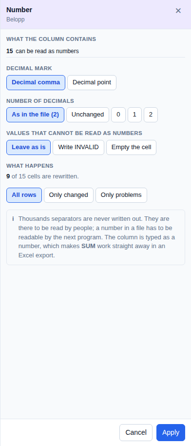

Turns text that looks like numbers into real numbers.

1. Column menu → **Numbers…**
2. Pick **decimal comma** or **decimal point**, and how many decimals.
3. **Apply**.

- Strips `kr`, `%` and thousands separators, and reads accounting's `(1 240,50)` and `1240–` as negative numbers.
- The point's ambiguity is handled like the dates': is `1.234` a decimal or a thousand? Evidence first, question second.
- The column is typed as a number, so sorting goes the numeric route and the Excel export writes real numbers.

### Phone numbers

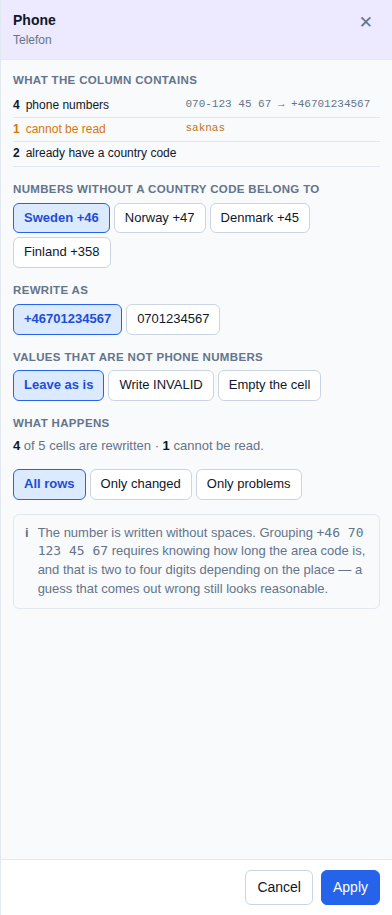

Normalises phone numbers so they can be compared across files.

1. Column menu → **Phone numbers…**
2. Choose which country numbers without a country code belong to.
3. Pick `+46701234567` or `0701234567`, and **Apply**.

- No pretty grouping with spaces — the area code's length varies, and a guess that gets it wrong looks plausible.

### Email to name

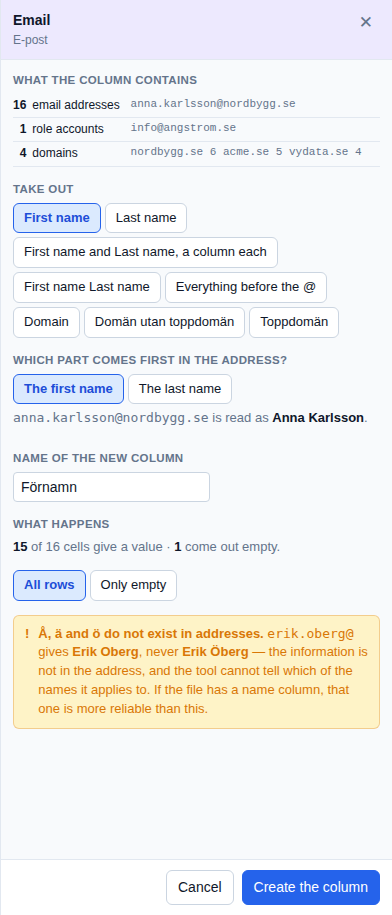

Pulls name and domain parts out of an address, as **new** columns beside it.

1. Column menu → **Email → name…**
2. Choose what you want under **Take out**: first name, last name, both as separate columns, `First Last`, domain, domain without the top level, or the top-level domain.
3. **Create the column**.

- Role accounts like `info@` do not become people.
- Å, ä and ö cannot be recovered from an address. The panel says so plainly.

### Split a column

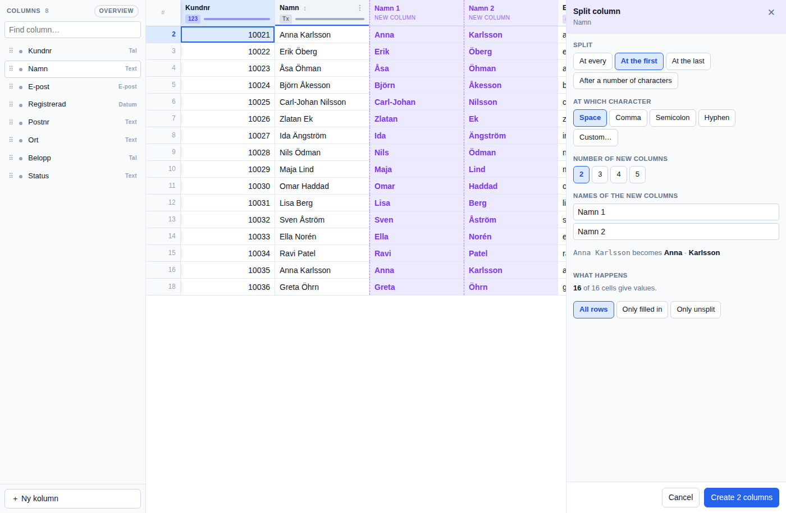

Splits one column into several new ones. The new columns are drawn as ghost columns with a dashed border before they are created.

1. Column menu → **Split the column…**
2. Choose where the split happens: **at every**, **at the first**, **at the last** occurrence of a character, or **after a number of characters**.
3. Pick the character and the number of new columns, and click **Create 2 columns**.

- **At the last** space keeps double first names together: `Anna Karlsson` and `Carl-Johan Nilsson` both split correctly.
- Whatever does not fit lands in the last column instead of disappearing. The panel warns when that happens.

### Merge columns

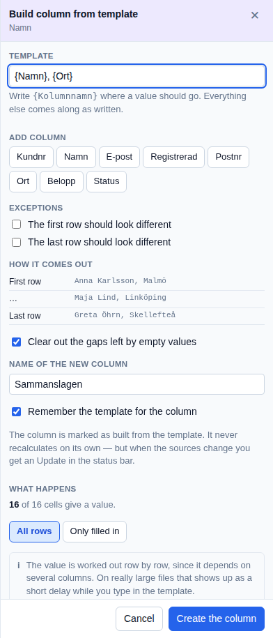

Builds a new column from a template.

1. Column menu → **Merge columns…**
2. Write the template, e.g. `{Förnamn} {Efternamn}` or `{Namn}, {Ort}`. **Add column** inserts a name for you.
3. **Create the column**.

- Column names that do not exist are reported as an error instead of quietly coming out empty.
- **Clear out the gaps left by empty values** removes the double spaces that otherwise appear when a field is empty.

### Calculate

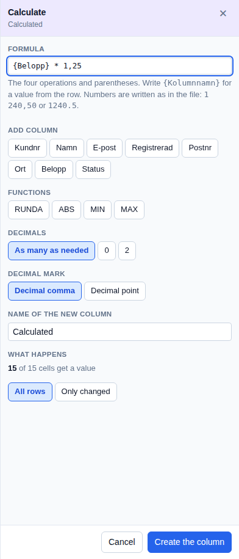

A new column from a formula.

1. Column menu → **Calculate…**
2. Write the formula, e.g. `{Antal} * {Pris}`, `RUNDA({Belopp} * 1,25; 2)` or `{Slut} - {Start}`.
3. Choose decimals and decimal mark, and **Create the column**.

- Four operators, parentheses and the functions `RUNDA`, `ABS`, `MIN`, `MAX`. The error in the formula is shown while you type.
- Numbers are written as they are in the file: `1 240,50` works just as well as `1240.5`.
- A date column counts as a number of days, so `{Slut} - {Start}` gives the difference in days.
- Empty cells, text that is not a number, and division by zero give **empty, not zero**. A gap can be seen; a wrong zero cannot.

### Find and replace

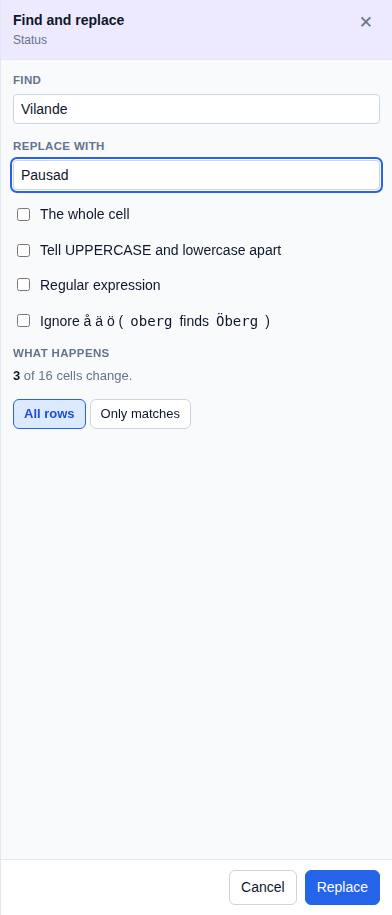

1. Column menu → **Find and replace…**
2. Write what to look for and what it should become.
3. **Apply**.

- A literal search is literal: `1.5` does not match `125`.
- Tick **Regular expression** for patterns. The error is shown while you type.
- **The whole cell** only replaces when the entire value matches, not part of it.

---

## Summarising and analysing

### Group and summarise

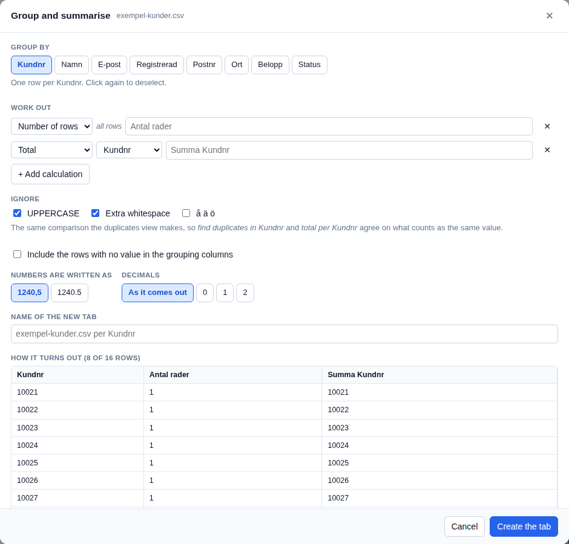

*Sum Belopp per Ort*, *number of orders per customer*, *first and last date per project* — one row per group.

1. **Summarise…** in the editing toolbar.
2. Pick the columns to **group by**.
3. Add the calculations: row count, sum, average, smallest, largest, filled in, unique, first, last, or the values listed out.
4. The box **How it turns out** shows the result while you set it up. **Create the tab**.

- The result becomes a **new tab**. The original is left alone.
- Grouping runs on **what you see**: if you filtered to 2024, the sum is 2024's sum.
- A sum with no readable numbers comes out **empty, not zero**.
- Rows with no value in the grouping columns are not counted into any group — they are reported, and can be included as a group of their own if that is what you want.

### Pivot

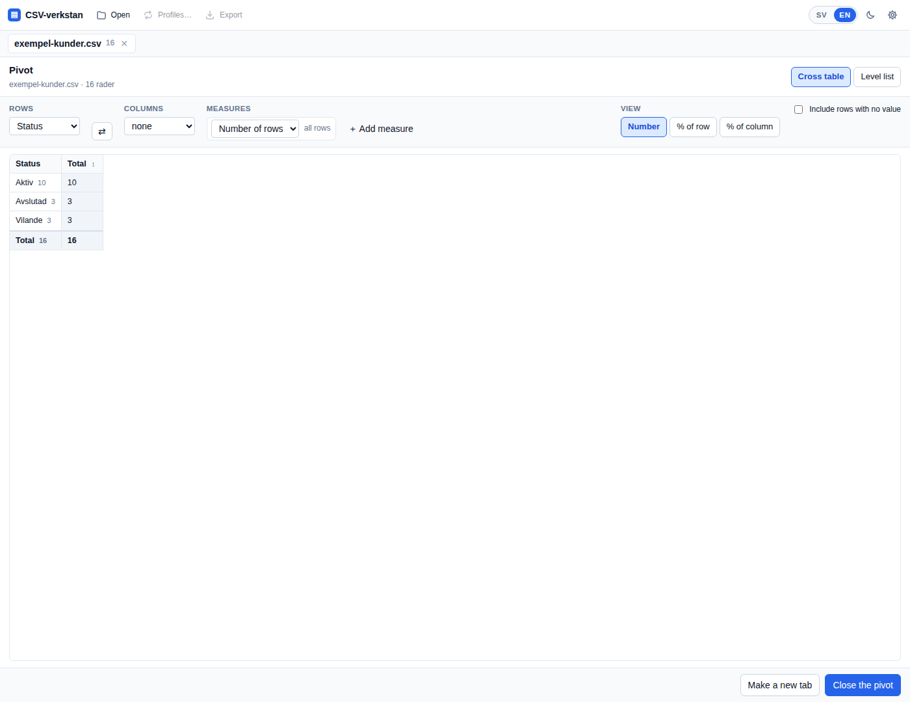

*Number of orders per Ort and Status* in a cross table. A **view of its own** that never touches the data.

1. **Pivot** in the editing toolbar. The view opens with a table that already says something.
2. Pick the dimension for **rows** and for **columns**. **⇄** swaps them.
3. Pick **measures** — count, sum, average, smallest, largest, filled in, unique. Several can sit side by side.
4. **Make a new tab** if you want to sort, filter or export the answer.

- **Level list** is the same calculation ordered in one direction instead, with subtotals at every level that can be collapsed.
- **View** switches between numbers, *% of row* and *% of column*. The percentage is only offered for measures that can be added up — an average is not part of another average.
- Clicking a column header sorts the rows by that column.
- The pivot counts the **whole file** by default; tick **only the ones shown right now** to follow the filter.

### Column overview

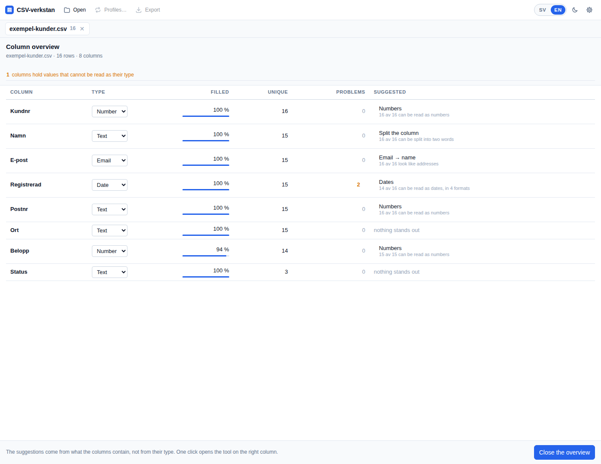

Answers the question you ask before you start: *what kind of file is this?*

1. **Overview** above the column list.
2. One row per column, with type, fill rate, unique values and problems.
3. Click a suggestion on the right — that opens the right tool on the right column.

### The column inspector

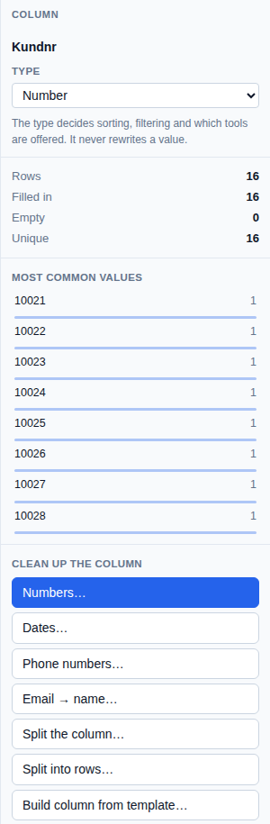

The panel on the right when no tool is open. It shows the column the cursor is in: how many values are filled in, empty, unique and unreadable, plus the most common values.

- **Show those N rows** filters out exactly the problematic rows.
- From here you can also change the type, rename, duplicate and delete the column.

---

## Multiple files

The three ways of putting data together from several files sit under **Multiple files ▾** in the editing toolbar. Open the files as separate tabs first.

### Merge two files

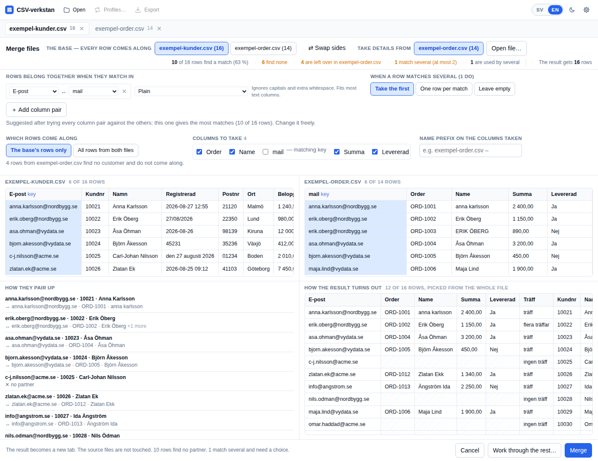

Puts rows that belong together side by side, matched on a key — like `VLOOKUP`, but with the answer key visible.

1. **Multiple files ▾ → Merge…**
2. The tool has already tried every column pair against every other and suggested the one that gives the most matches. Change it freely, or **＋ Add column pair**.
3. Read the numbers at the top: how many rows find a match, how many are left over, how many match more than one.
4. Tick the **columns to take**, and **Merge**.

- The view shows four things at once while you set it up: both source files with the normalised key under each value, how the rows pair up, and how the result turns out. The preview's rows mix hits and misses in the proportion they actually have.
- The result becomes a **new tab** with a **Träff** column: `träff`, `ingen träff` or `flera träffar`. (That column is data, so it stays Swedish in both languages.) It is what makes the unmatched rows filterable afterwards.
- **Which rows come along** decides whether only the base's rows follow, or all rows from both files.
- The comparison can be plain, character-exact, without å ä ö, digits only, email against name, or name against first + last name. **Empty keys never match.**
- **⇄ Swap sides** changes which file is the base.

### The matching workbench

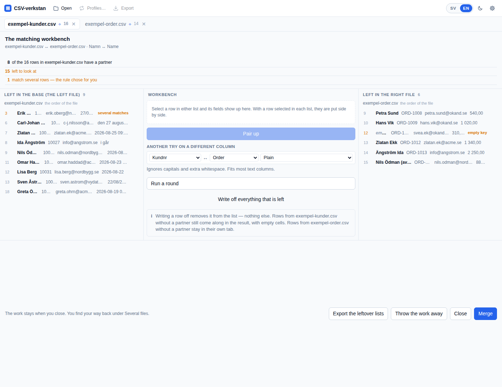

For the rows that were left over. A merge never ends at a hundred percent.

1. **Work through the rest…** in the merge view — or **Continue** on the chip in the status bar when you come back later.
2. The unmatched rows sit as two lists. Click a row in each and compare them field by field on the workbench.
3. Four ways out: **Pair up** by hand, fix a value in place so the row finds its partner by itself, **another try on a different column**, or **write the row off**.
4. **Merge** when you are happy. Every round puts its result in a tab of its **own**.

- **Fuzzy** similarity exists only here, never across the whole file. The score is shown as two numbers — spelling and word order — so it says *why*.
- The leftover list distinguishes a row without a partner, a row whose key is empty, and a row that matches several and needs a choice.
- The work survives closing the view and reloading the page. **Export the leftover lists** gives one CSV per file to send on.

### Combine files

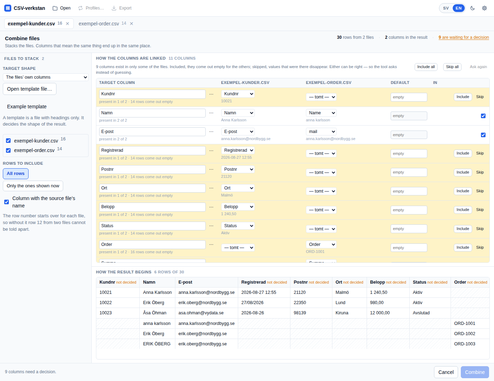

Stacks files **on top of each other**. Twelve monthly files, three salespeople's customer lists — the same kind of data, but the headers are named differently.

1. **Multiple files ▾ → Combine…**
2. The alias map shows one row per target column and one column per file, and has already guessed `Namn`, `Name` and `kundnamn` together.
3. Columns that exist in only some files have to be **decided** — **Include** or **Skip**, one by one or all at once.
4. **Combine**.

- Under each source picker sits one of the column's values, because headers lie: `Kontakt` can be a name in one file and an address in another.
- If the tool guesses wrong, there is **Same column as…** on the row.
- A **Default** value fills the files that give nothing — `Unknown` where the column is missing. Only there: a cell that exists but is empty is never touched.
- A column with the source file's name comes along by default, since the row number starts over for each file.

### Fill a template with data

The same view as **Combine**, but the shape comes from a **template file**: a document with headers only.

1. **Multiple files ▾ → Fill a template with data…**
2. Open the template file, or use **Example template**.
3. Point out where each target column takes its value from, and run.

- The template decides which columns the result has, what they are called and in which order they come.
- Example rows in the template never come along, but are shown as a hint in the map.
- Columns that exist in the files but not in the template are not thrown away quietly — you are asked about them.

---

## Keeping your work

### Profiles

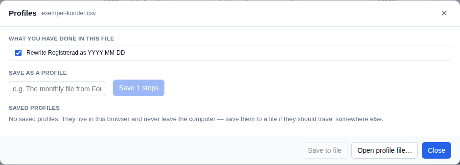

The same export file arrives every month, and the same ten manual steps have to be repeated. A profile is the list of those steps.

1. **Profiles…** in the app row.
2. The dialog shows what you did in this file. **Save as a profile**, with a name.
3. Open next month's file and press **Run** on the profile.

- Columns are matched by **name**, since a column id means nothing in another file. If a step cannot find its column, it says so.
- Only what can be repeated comes along. A hand-edited cell or a deleted row points at that specific file's rows, and is greyed out with its reason.
- After the run it says step by step what happened. `Ctrl+Z` goes back one step at a time.
- **Save to file** if the profile needs to travel somewhere else.

### Your tabs come back

The files you have open are saved in your own browser — with sorting, filter, duplicate view and selection — and come back the next time you open the page. A closed tab is forgotten immediately.

- **The undo history does not come along.** The tool says so when the tabs come back.
- **Forget saved files** in the command palette empties what was saved but leaves your tabs open.

### Start over

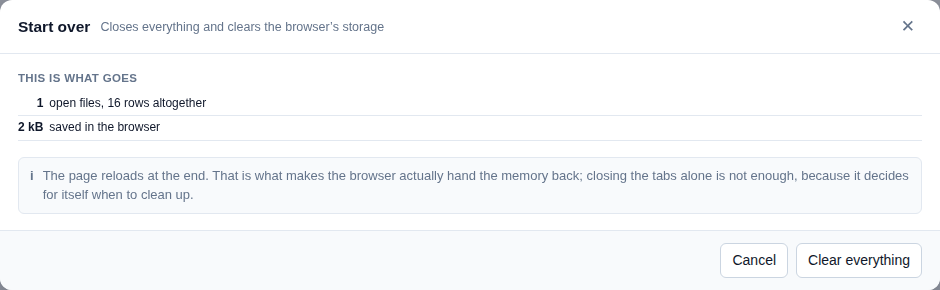

When you are done: click **● All local** in the status bar.

1. The dialog lists what exists — open files with row counts, a merge in progress, and how many bytes the browser has stored.
2. Files with changes that have not been exported are listed separately.
3. **Clear everything.** The page reloads.

This is one of the few actions that **cannot** be undone.

---

## Shortcuts and settings

### The command palette

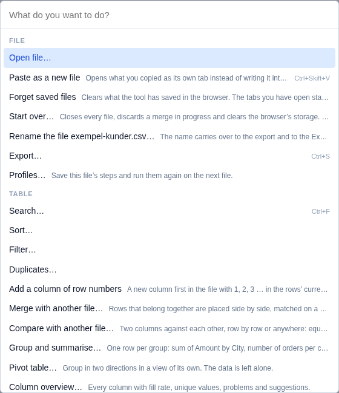

`Ctrl+K` opens the palette. It is the way in for someone who knows *what* they want to do but not where the button is.

- The search is literal and accent-insensitive, and finds Swedish terms too: `undo`, `join`, `makro`.
- Column commands apply to the column the cursor is in, and are listed with the column's name spelled out.

### Keyboard

| Shortcut | Does |
| --- | --- |
| `Ctrl+K` | The command palette |
| `Ctrl+F` | Search |
| `Ctrl+S` | Export |
| `Ctrl+Z` · `Ctrl+Y` | Undo · Redo |
| `Enter` · `F2` · double-click | Edit the cell |
| `Shift`+arrow keys | Extend the selection |
| `Ctrl+D` | Fill down |
| `Delete` | Empty the selection |
| `Ctrl+C` · `Ctrl+V` | Copy · Paste (TSV, as Excel does) |
| `Ctrl+Shift+V` | Paste as a new file |
| `F2` in the header | Rename the column |
| The menu key | Opens the menu at the selection |

### Language, theme and toolbar

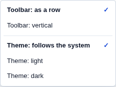

On the far right of the app row: the `SV | EN` language choice, light/dark mode and the settings gear.

- **Language** changes the labels only. Sorting is still Swedish, numbers are still written `1 240,50` and the date tool still reads `augusti` — otherwise the same file sorted in two languages would give two orders.
- **Theme** can follow the system, or be locked to light or dark.
- **The toolbar** can sit as a row under the tabs or vertically to the left of the columns. The choice is saved.
